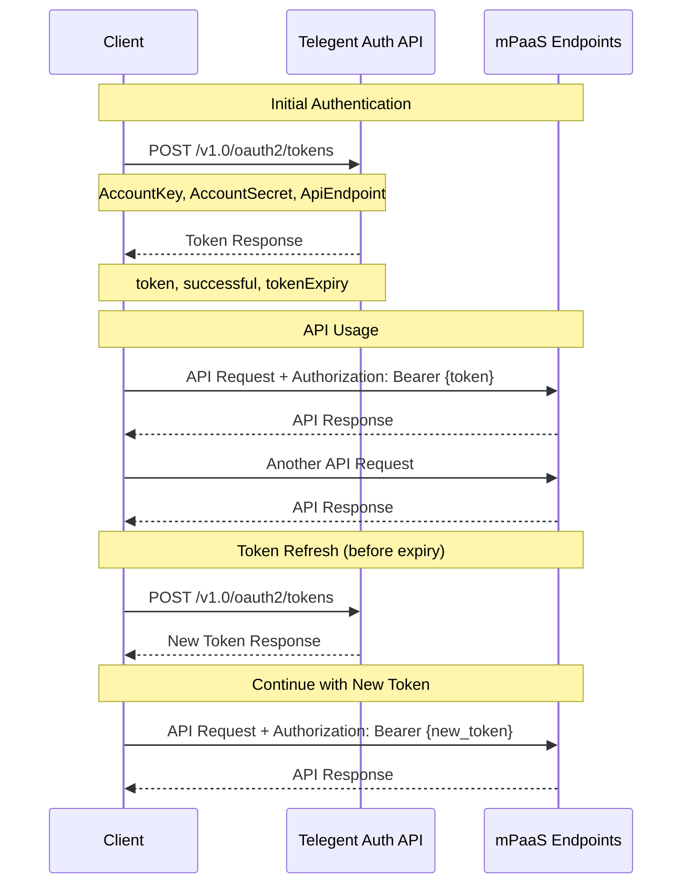

# 🔐 Authentication

Telegent mPaaS APIs use **JWT-based token authentication** for secure access to all endpoints. This guide covers everything you need to know about authenticating with our APIs.

## 🌟 Overview

All API requests to Telegent mPaaS require a valid access token obtained through our OAuth2 token endpoint. The authentication flow is designed to be:

- **Secure**: JWT tokens with configurable expiration
- **Simple**: Single endpoint for token generation
- **Scalable**: Stateless authentication suitable for high-volume applications
- **Flexible**: Tokens can be scoped to specific API endpoints

## 🔑 API Token Endpoint

<div className="mt-4 border border-accent/20 rounded-md overflow-hidden">
  <div className="bg-accent/5 px-4 py-2 border-b border-accent/20 flex justify-between items-center">
    <div className="flex items-center gap-2">
      <span className="bg-blue-500 text-white px-2 py-0.5 rounded-md text-xs font-semibold">POST</span>
      <span className="font-mono text-sm font-medium">/v1.0/oauth2/tokens</span>
    </div>
    <span className="text-xs font-medium text-slate-500">Generate Authentication Token</span>
  </div>
  <div className="p-4">
    <p className="text-sm mb-4">Generates a JWT access token for authenticating with other mPaaS API endpoints. This is your entry point to the platform.</p>

    <div className="mb-6">
      <h4 className="text-sm font-semibold mb-2 text-slate-800 dark:text-slate-200">🔧 Request Body</h4>
      <div className="bg-slate-50 dark:bg-slate-800/50 rounded-md p-3 overflow-x-auto">
```json
{
  "AccountKey": "{{AccountKey}}",
  "AccountSecret": "{{AccountSecret}}",
  "ApiEndpoint": "https://api.telegent.com/v1.0/message/routes"
}
```
      </div>
    </div>

    <div className="mb-6">
      <h4 className="text-sm font-semibold mb-2 text-slate-800 dark:text-slate-200">📋 Parameters</h4>
      <div className="overflow-x-auto">
        <table className="min-w-full text-sm border-collapse">
          <thead>
            <tr className="border-b border-accent/20">
              <th className="text-left py-3 px-2 font-semibold text-slate-700 dark:text-slate-300">Parameter</th>
              <th className="text-left py-3 px-2 font-semibold text-slate-700 dark:text-slate-300">Type</th>
              <th className="text-left py-3 px-2 font-semibold text-slate-700 dark:text-slate-300">Required</th>
              <th className="text-left py-3 px-2 font-semibold text-slate-700 dark:text-slate-300">Description</th>
            </tr>
          </thead>
          <tbody>
            <tr className="border-b border-accent/10 hover:bg-accent/5">
              <td className="py-3 px-2 font-mono text-blue-600 dark:text-blue-400">AccountKey</td>
              <td className="py-3 px-2 text-slate-600 dark:text-slate-400">String</td>
              <td className="py-3 px-2">
                <span className="bg-red-100 text-red-800 dark:bg-red-900 dark:text-red-200 px-2 py-0.5 rounded text-xs font-medium">Yes</span>
              </td>
              <td className="py-3 px-2 text-slate-600 dark:text-slate-400">Your unique Telegent account identifier (begins with 'DID-')</td>
            </tr>
            <tr className="border-b border-accent/10 hover:bg-accent/5">
              <td className="py-3 px-2 font-mono text-blue-600 dark:text-blue-400">AccountSecret</td>
              <td className="py-3 px-2 text-slate-600 dark:text-slate-400">String</td>
              <td className="py-3 px-2">
                <span className="bg-red-100 text-red-800 dark:bg-red-900 dark:text-red-200 px-2 py-0.5 rounded text-xs font-medium">Yes</span>
              </td>
              <td className="py-3 px-2 text-slate-600 dark:text-slate-400">Your account secret key (treat as password - never expose in client-side code)</td>
            </tr>
            <tr className="border-b border-accent/10 hover:bg-accent/5">
              <td className="py-3 px-2 font-mono text-blue-600 dark:text-blue-400">ApiEndpoint</td>
              <td className="py-3 px-2 text-slate-600 dark:text-slate-400">String</td>
              <td className="py-3 px-2">
                <span className="bg-red-100 text-red-800 dark:bg-red-900 dark:text-red-200 px-2 py-0.5 rounded text-xs font-medium">Yes</span>
              </td>
              <td className="py-3 px-2 text-slate-600 dark:text-slate-400">The specific API endpoint you intend to access (used for token scoping)</td>
            </tr>
          </tbody>
        </table>
      </div>
    </div>

    <div className="mb-6">
      <h4 className="text-sm font-semibold mb-2 text-slate-800 dark:text-slate-200">✅ Successful Response</h4>
      <p className="text-sm mb-3 text-slate-600 dark:text-slate-400">A successful authentication returns a JSON object containing the access token and metadata.</p>
      <div className="bg-slate-50 dark:bg-slate-800/50 rounded-md p-3 overflow-x-auto">
```json
{
  "token": "eyJhbGciOiJIUzI1NiIsInR5cCI6IkpXVCJ9.eyJodHRwOi8vc2NoZW1hcy54bWxzb2FwLm9yZy93cy8yMDA1LzA1L2lkZW50aXR5L2NsYWltcy9uYW1laWRlbnRpZmllciI6IkRJRC0xZTg5MzlhYi0zZjNjLTRkYjEtODlkNy05NTZkODBmZDc5M2oiLCJodHRwOi8vc2NoZW1hcy5taWNyb3NvZnQuY29tL3dzLzIwMDgvMDYvaWRlbnRpdHkvY2xhaW1zL3VzZXJkYXRhIjoiNHd2ZStrT2E3YjhIUGk5ODFLek9weGNUSkYwVHNET3F0VXdLWHVmWXVFalBwMm96TkdmMlVHUlFZazJJTkV3T2RDUHVRWm9teFQzWW9yVlo1ZWY4SDJFWmF2WlpmdnNOYmNLc1VEMkd3Z3J6LzlTcGt1WkFYN1MvbVdTTTVjWFZVOVlyZUxhWXFuWTNNWXhrd0diRUZYdHNYS2JLNnBhcGxSRDJlZlhKWlRkcDA4c3hmYWcrTEJtTDFXRk1qZmMwIiwiZXhwIjoxNzQ2MjEwOTczLCJpc3MiOiJodHRwczovL2FwaS50ZWxlZ2VudC5jbyIsImF1ZCI6ImNvbS50ZWxlZ2VudC5jbyJ9.-btpm87tbFgNDmS-InZonSGyjqnfBSnotx9mazhvmE0",
  "successful": true,
  "tokenExpiry": "05/02/2025 06:36:13 PM",
  "apiEndpoint": "https://api.telegent.com/v1.0/numbers/availability"
}
```
      </div>

      <div className="mt-3">
        <h5 className="text-xs font-semibold mb-2 text-slate-700 dark:text-slate-300">Response Fields</h5>
        <div className="text-xs space-y-1 text-slate-600 dark:text-slate-400">
          <div><code className="text-blue-600 dark:text-blue-400">token</code> - JWT access token to use in Authorization header</div>
          <div><code className="text-blue-600 dark:text-blue-400">successful</code> - Boolean indicating authentication success</div>
          <div><code className="text-blue-600 dark:text-blue-400">tokenExpiry</code> - Timestamp when the token expires (typically 1 hour)</div>
          <div><code className="text-blue-600 dark:text-blue-400">apiEndpoint</code> - Confirms the endpoint this token is scoped for</div>
        </div>
      </div>
    </div>

    <div className="mb-6">
      <h4 className="text-sm font-semibold mb-2 text-slate-800 dark:text-slate-200">💻 Code Examples</h4>

      <div className="space-y-4">
        <div>
          <h5 className="text-xs font-medium mb-2 text-slate-700 dark:text-slate-300 flex items-center gap-1">
            <span>🐍</span> Python
          </h5>
          <div className="bg-slate-50 dark:bg-slate-800/50 rounded-md p-3 overflow-x-auto">
```python
import requests
import json

def get_telegent_token(account_key, account_secret, api_endpoint):
    """
    Authenticate with Telegent mPaaS and get access token
    """
    url = "https://api.telegent.com/v1.0/oauth2/tokens"

    payload = {
        "AccountKey": account_key,
        "AccountSecret": account_secret,
        "ApiEndpoint": api_endpoint
    }

    headers = {
        'Content-Type': 'application/json'
    }

    try:
        response = requests.post(url, headers=headers, data=json.dumps(payload))
        response.raise_for_status()  # Raises an HTTPError for bad responses

        result = response.json()
        if result.get('successful'):
            return result['token']
        else:
            raise Exception(f"Authentication failed: {result}")

    except requests.exceptions.RequestException as e:
        print(f"Request failed: {e}")
        raise

# Usage
token = get_telegent_token(
    account_key="{{AccountKey}}",
    account_secret="{{AccountSecret}}",
    api_endpoint="https://api.telegent.com/v1.0/numbers/availability"
)
print(f"Token obtained: {token[:50]}...")
```
          </div>
        </div>

        <div>
          <h5 className="text-xs font-medium mb-2 text-slate-700 dark:text-slate-300 flex items-center gap-1">
            <span>🟨</span> JavaScript/Node.js
          </h5>
          <div className="bg-slate-50 dark:bg-slate-800/50 rounded-md p-3 overflow-x-auto">
```javascript
async function getTelegentToken(accountKey, accountSecret, apiEndpoint) {
  const url = 'https://api.telegent.com/v1.0/oauth2/tokens';

  const payload = {
    AccountKey: accountKey,
    AccountSecret: accountSecret,
    ApiEndpoint: apiEndpoint
  };

  try {
    const response = await fetch(url, {
      method: 'POST',
      headers: {
        'Content-Type': 'application/json'
      },
      body: JSON.stringify(payload)
    });

    if (!response.ok) {
      throw new Error(`HTTP error! status: ${response.status}`);
    }

    const result = await response.json();

    if (result.successful) {
      return result.token;
    } else {
      throw new Error(`Authentication failed: ${JSON.stringify(result)}`);
    }
  } catch (error) {
    console.error('Authentication error:', error);
    throw error;
  }
}

// Usage
const token = await getTelegentToken(
  '{{AccountKey}}',
  '{{AccountSecret}}',
  'https://api.telegent.com/v1.0/numbers/availability'
);
console.log(`Token obtained: ${token.substring(0, 50)}...`);
```
          </div>
        </div>

        <div>
          <h5 className="text-xs font-medium mb-2 text-slate-700 dark:text-slate-300 flex items-center gap-1">
            <span>📱</span> cURL
          </h5>
          <div className="bg-slate-50 dark:bg-slate-800/50 rounded-md p-3 overflow-x-auto">
```bash
curl -X POST https://api.telegent.com/v1.0/oauth2/tokens \
  -H "Content-Type: application/json" \
  -d '{
    "AccountKey": "{{AccountKey}}",
    "AccountSecret": "{{AccountSecret}}",
    "ApiEndpoint": "https://api.telegent.com/v1.0/numbers/availability"
  }'
```
          </div>
        </div>
      </div>
    </div>

    <div className="rounded-md bg-blue-50 dark:bg-blue-900/20 border border-blue-200 dark:border-blue-700 p-4">
      <div className="flex">
        <div className="flex-shrink-0">
          <svg className="h-5 w-5 text-blue-400" viewBox="0 0 20 20" fill="currentColor">
            <path fillRule="evenodd" d="M18 10a8 8 0 11-16 0 8 8 0 0116 0zm-7-4a1 1 0 11-2 0 1 1 0 012 0zM9 9a1 1 0 000 2v3a1 1 0 001 1h1a1 1 0 100-2v-3a1 1 0 00-1-1H9z" clipRule="evenodd" />
          </svg>
        </div>
        <div className="ml-3">
          <h3 className="text-sm font-medium text-blue-800 dark:text-blue-200">🔒 Security Best Practices</h3>
          <div className="mt-2 text-sm text-blue-700 dark:text-blue-300 space-y-1">
            <p>• <strong>Never expose</strong> your AccountKey and AccountSecret in client-side code</p>
            <p>• <strong>Store credentials securely</strong> using environment variables or secure vaults</p>
            <p>• <strong>Implement token refresh</strong> logic before tokens expire</p>
            <p>• <strong>Use HTTPS only</strong> for all API communications</p>
            <p>• <strong>Monitor token usage</strong> and implement proper logging</p>
          </div>
        </div>
      </div>
    </div>
  </div>
</div>

## ⏰ Token Lifecycle Management

### Token Expiration
- **Default Expiry**: 3600 seconds (1 hour)
- **Grace Period**: Tokens remain valid for a short period after expiry for in-flight requests
- **Renewal**: Request a new token before the current one expires

### Best Practices
1. **Cache tokens** and reuse them until expiry
2. **Implement auto-refresh** 5-10 minutes before expiration
3. **Handle 401 errors** by automatically re-authenticating
4. **Monitor token metrics** for security and performance

## 🔄 Authentication Flow

<div className="my-6">

</div>

## 🚨 Error Handling

### Common Error Responses

#### 401 Unauthorized: Invalid Credentials
```json
{
  "Type": "https://tools.ietf.org/html/rfc7235#section-3.1",
  "Title": "Unauthorized",
  "Status": 401,
  "Errors": {
    "Auth": ["Invalid account credentials provided"]
  },
  "TraceId": "0HMMLJK38TNP1:00000001"
}
```

#### 403 Forbidden: Insufficient Permissions
```json
{
  "Type": "https://tools.ietf.org/html/rfc7235#section-3.1",
  "Title": "Forbidden",
  "Status": 403,
  "Detail": "Account does not have access to the requested endpoint",
  "TraceId": "0HMMLJK38TNP1:00000002"
}
```

#### 429 Too Many Requests: Rate Limit Exceeded
```json
{
  "Type": "https://tools.ietf.org/html/rfc6585#section-4",
  "Title": "Too Many Requests",
  "Status": 429,
  "Detail": "Rate limit exceeded. Please wait before making more requests.",
  "RetryAfter": "60",
  "TraceId": "0HMMLJK38TNP1:00000003"
}
```

### Error Handling Strategy

```javascript
async function makeAuthenticatedRequest(url, options = {}) {
  let token = await getStoredToken();

  // Check if token is expired
  if (isTokenExpired(token)) {
    token = await refreshToken();
  }

  try {
    const response = await fetch(url, {
      ...options,
      headers: {
        'Authorization': `Bearer ${token}`,
        'Content-Type': 'application/json',
        ...options.headers
      }
    });

    if (response.status === 401) {
      // Token might be invalid, try to refresh
      token = await refreshToken();

      // Retry the request with new token
      return await fetch(url, {
        ...options,
        headers: {
          'Authorization': `Bearer ${token}`,
          'Content-Type': 'application/json',
          ...options.headers
        }
      });
    }

    if (response.status === 429) {
      // Rate limited, implement exponential backoff
      const retryAfter = response.headers.get('Retry-After') || 60;
      await new Promise(resolve => setTimeout(resolve, retryAfter * 1000));
      return makeAuthenticatedRequest(url, options);
    }

    return response;
  } catch (error) {
    console.error('Request failed:', error);
    throw error;
  }
}
```

## 🎯 Using Tokens with API Requests

Once you have a valid token, include it in the `Authorization` header of all subsequent API requests:

```bash
# Example: Check number availability
curl -X POST https://api.telegent.com/v1.0/numbers/availability \
  -H "Authorization: Bearer YOUR_JWT_TOKEN" \
  -H "Content-Type: application/json" \
  -d '{
    "NumberType": "mobile",
    "MessageEnabled": true,
    "VoiceEnabled": true,
    "AreaCode": "201"
  }'
```

### Authorization Header Format
```
Authorization: Bearer <your_jwt_token_here>
```

## 📊 Token Information

Telegent JWT tokens contain the following claims:
- **Account ID**: Your unique account identifier
- **Expiration**: Token expiry timestamp
- **Issuer**: api.telegent.com
- **Audience**: Specific API endpoints the token is valid for

<div className="mt-6 p-4 border border-amber-200 dark:border-amber-700 bg-amber-50 dark:bg-amber-900/20 rounded-md">
  <div className="flex">
    <div className="flex-shrink-0">
      <svg className="h-5 w-5 text-amber-400" viewBox="0 0 20 20" fill="currentColor">
        <path fillRule="evenodd" d="M8.257 3.099c.765-1.36 2.722-1.36 3.486 0l5.58 9.92c.75 1.334-.213 2.98-1.742 2.98H4.42c-1.53 0-2.493-1.646-1.743-2.98l5.58-9.92zM11 13a1 1 0 11-2 0 1 1 0 012 0zm-1-8a1 1 0 00-1 1v3a1 1 0 002 0V6a1 1 0 00-1-1z" clipRule="evenodd" />
      </svg>
    </div>
    <div className="ml-3">
      <h3 className="text-sm font-medium text-amber-800 dark:text-amber-200">⚠️ Important Notes</h3>
      <div className="mt-2 text-sm text-amber-700 dark:text-amber-300">
        <p>Tokens are <strong>scoped to specific API endpoints</strong>. If you need to access multiple endpoints, you may need to obtain separate tokens or use a more general endpoint scope when authenticating.</p>
      </div>
    </div>
  </div>
</div>