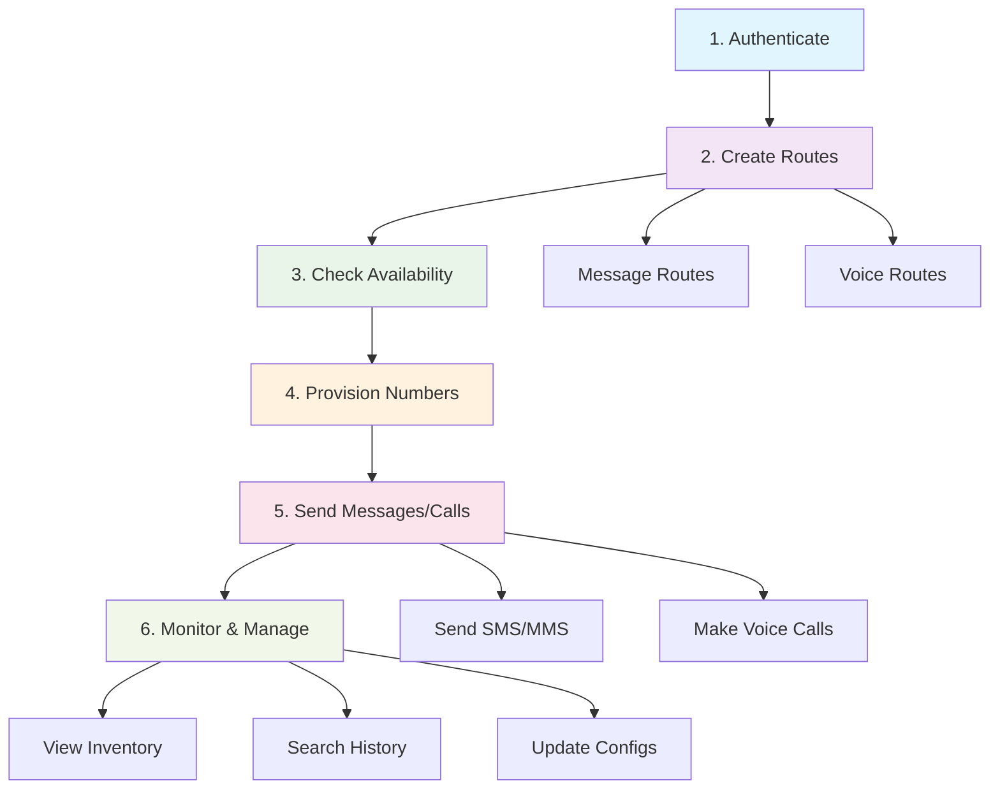

# 🚀 Telegent mPaaS Core APIs

Welcome to the **comprehensive API reference** for Telegent's mPaaS (Mobile Platform as a Service). Our enterprise-grade APIs provide everything you need to build powerful telecommunications applications with **messaging**, **voice**, and **mobile number management** capabilities.

## 🌟 Platform Overview

Telegent mPaaS delivers a complete telecommunications platform through RESTful APIs that are:

- **🔒 Enterprise-Secure**: JWT authentication, IP whitelisting, and SOC 2 compliance
- **⚡ High-Performance**: Sub-100ms latency with 99.99% uptime SLA
- **🌍 Globally Scalable**: Auto-scaling infrastructure across multiple regions  
- **🧩 Developer-Friendly**: Comprehensive SDKs, webhooks, and detailed documentation

## 🛠️ Core API Categories

<div className="grid grid-cols-1 md:grid-cols-2 gap-6 mt-8">
  <div className="group rounded-lg border border-accent/20 p-6 hover:border-accent/40 hover:shadow-lg transition-all duration-200 bg-gradient-to-br from-blue-50/50 to-blue-100/30 dark:from-blue-900/20 dark:to-blue-800/10">
    <div className="flex items-center gap-3 mb-3">
      <div className="p-2 bg-blue-500 rounded-lg">
        <svg className="w-5 h-5 text-white" fill="none" stroke="currentColor" viewBox="0 0 24 24">
          <path strokeLinecap="round" strokeLinejoin="round" strokeWidth={2} d="M12 15v2m-6 4h12a2 2 0 002-2v-6a2 2 0 00-2-2H6a2 2 0 00-2 2v6a2 2 0 002 2zm10-10V7a4 4 0 00-8 0v4h8z" />
        </svg>
      </div>
      <h3 className="text-lg font-semibold text-blue-900 dark:text-blue-100">Authentication</h3>
    </div>
    <p className="text-sm text-blue-700 dark:text-blue-300 mb-4 leading-relaxed">Secure JWT-based authentication system providing access to all mPaaS endpoints with configurable token scoping and expiration.</p>
    <div className="space-y-2 text-xs text-blue-600 dark:text-blue-400 mb-4">
      <div className="flex items-center gap-2">
        <span className="w-1.5 h-1.5 bg-blue-500 rounded-full"></span>
        <span>OAuth2 token generation</span>
      </div>
      <div className="flex items-center gap-2">
        <span className="w-1.5 h-1.5 bg-blue-500 rounded-full"></span>
        <span>JWT token validation</span>
      </div>
      <div className="flex items-center gap-2">
        <span className="w-1.5 h-1.5 bg-blue-500 rounded-full"></span>
        <span>Automatic token refresh</span>
      </div>
    </div>
    <div className="mt-4">
      <a href="/api-reference/authentication" className="inline-flex items-center text-sm font-medium text-blue-600 dark:text-blue-400 hover:text-blue-800 dark:hover:text-blue-200 transition-colors group-hover:underline">
        View Authentication APIs 
        <svg className="ml-1 w-4 h-4 transition-transform group-hover:translate-x-0.5" fill="none" stroke="currentColor" viewBox="0 0 24 24">
          <path strokeLinecap="round" strokeLinejoin="round" strokeWidth={2} d="M9 5l7 7-7 7" />
        </svg>
      </a>
    </div>
  </div>
  
  <div className="group rounded-lg border border-accent/20 p-6 hover:border-accent/40 hover:shadow-lg transition-all duration-200 bg-gradient-to-br from-green-50/50 to-green-100/30 dark:from-green-900/20 dark:to-green-800/10">
    <div className="flex items-center gap-3 mb-3">
      <div className="p-2 bg-green-500 rounded-lg">
        <svg className="w-5 h-5 text-white" fill="none" stroke="currentColor" viewBox="0 0 24 24">
          <path strokeLinecap="round" strokeLinejoin="round" strokeWidth={2} d="M3 5a2 2 0 012-2h3.28a1 1 0 01.948.684l1.498 4.493a1 1 0 01-.502 1.21l-2.257 1.13a11.042 11.042 0 005.516 5.516l1.13-2.257a1 1 0 011.21-.502l4.493 1.498a1 1 0 01.684.949V19a2 2 0 01-2 2h-1C9.716 21 3 14.284 3 6V5z" />
        </svg>
      </div>
      <h3 className="text-lg font-semibold text-green-900 dark:text-green-100">Intelligent Mobile Numbers</h3>
    </div>
    <p className="text-sm text-green-700 dark:text-green-300 mb-4 leading-relaxed">Complete lifecycle management of phone numbers including provisioning, porting, configuration, and real-time inventory management.</p>
    <div className="space-y-2 text-xs text-green-600 dark:text-green-400 mb-4">
      <div className="flex items-center gap-2">
        <span className="w-1.5 h-1.5 bg-green-500 rounded-full"></span>
        <span>Number availability & search</span>
      </div>
      <div className="flex items-center gap-2">
        <span className="w-1.5 h-1.5 bg-green-500 rounded-full"></span>
        <span>Provisioning & porting</span>
      </div>
      <div className="flex items-center gap-2">
        <span className="w-1.5 h-1.5 bg-green-500 rounded-full"></span>
        <span>Configuration & inventory</span>
      </div>
    </div>
    <div className="mt-4">
      <a href="/api-reference/intelligent-mobile-numbers" className="inline-flex items-center text-sm font-medium text-green-600 dark:text-green-400 hover:text-green-800 dark:hover:text-green-200 transition-colors group-hover:underline">
        View Mobile Number APIs 
        <svg className="ml-1 w-4 h-4 transition-transform group-hover:translate-x-0.5" fill="none" stroke="currentColor" viewBox="0 0 24 24">
          <path strokeLinecap="round" strokeLinejoin="round" strokeWidth={2} d="M9 5l7 7-7 7" />
        </svg>
      </a>
    </div>
  </div>

  <div className="group rounded-lg border border-accent/20 p-6 hover:border-accent/40 hover:shadow-lg transition-all duration-200 bg-gradient-to-br from-purple-50/50 to-purple-100/30 dark:from-purple-900/20 dark:to-purple-800/10">
    <div className="flex items-center gap-3 mb-3">
      <div className="p-2 bg-purple-500 rounded-lg">
        <svg className="w-5 h-5 text-white" fill="none" stroke="currentColor" viewBox="0 0 24 24">
          <path strokeLinecap="round" strokeLinejoin="round" strokeWidth={2} d="M8 12h.01M12 12h.01M16 12h.01M21 12c0 4.418-4.03 8-9 8a9.863 9.863 0 01-4.255-.949L3 20l1.395-3.72C3.512 15.042 3 13.574 3 12c0-4.418 4.03-8 9-8s9 3.582 9 8z" />
        </svg>
      </div>
      <h3 className="text-lg font-semibold text-purple-900 dark:text-purple-100">Intelligent Messaging</h3>
    </div>
    <p className="text-sm text-purple-700 dark:text-purple-300 mb-4 leading-relaxed">Advanced SMS/MMS platform with intelligent routing, delivery optimization, and comprehensive message lifecycle management.</p>
    <div className="space-y-2 text-xs text-purple-600 dark:text-purple-400 mb-4">
      <div className="flex items-center gap-2">
        <span className="w-1.5 h-1.5 bg-purple-500 rounded-full"></span>
        <span>SMS/MMS sending & receiving</span>
      </div>
      <div className="flex items-center gap-2">
        <span className="w-1.5 h-1.5 bg-purple-500 rounded-full"></span>
        <span>Route configuration & management</span>
      </div>
      <div className="flex items-center gap-2">
        <span className="w-1.5 h-1.5 bg-purple-500 rounded-full"></span>
        <span>Message history & analytics</span>
      </div>
    </div>
    <div className="mt-4">
      <a href="/api-reference/intelligent-messaging" className="inline-flex items-center text-sm font-medium text-purple-600 dark:text-purple-400 hover:text-purple-800 dark:hover:text-purple-200 transition-colors group-hover:underline">
        View Messaging APIs 
        <svg className="ml-1 w-4 h-4 transition-transform group-hover:translate-x-0.5" fill="none" stroke="currentColor" viewBox="0 0 24 24">
          <path strokeLinecap="round" strokeLinejoin="round" strokeWidth={2} d="M9 5l7 7-7 7" />
        </svg>
      </a>
    </div>
  </div>

  <div className="group rounded-lg border border-accent/20 p-6 hover:border-accent/40 hover:shadow-lg transition-all duration-200 bg-gradient-to-br from-orange-50/50 to-orange-100/30 dark:from-orange-900/20 dark:to-orange-800/10">
    <div className="flex items-center gap-3 mb-3">
      <div className="p-2 bg-orange-500 rounded-lg">
        <svg className="w-5 h-5 text-white" fill="none" stroke="currentColor" viewBox="0 0 24 24">
          <path strokeLinecap="round" strokeLinejoin="round" strokeWidth={2} d="M19 11a7 7 0 01-7 7m0 0a7 7 0 01-7-7m7 7v4m0 0H8m4 0h4m-4-8a3 3 0 01-3-3V5a3 3 0 116 0v6a3 3 0 01-3 3z" />
        </svg>
      </div>
      <h3 className="text-lg font-semibold text-orange-900 dark:text-orange-100">Intelligent Voice</h3>
    </div>
    <p className="text-sm text-orange-700 dark:text-orange-300 mb-4 leading-relaxed">Enterprise voice solutions with SIP trunking, advanced call routing, call streaming, and comprehensive voice analytics.</p>
    <div className="space-y-2 text-xs text-orange-600 dark:text-orange-400 mb-4">
      <div className="flex items-center gap-2">
        <span className="w-1.5 h-1.5 bg-orange-500 rounded-full"></span>
        <span>Voice route configuration</span>
      </div>
      <div className="flex items-center gap-2">
        <span className="w-1.5 h-1.5 bg-orange-500 rounded-full"></span>
        <span>SIP trunk management</span>
      </div>
      <div className="flex items-center gap-2">
        <span className="w-1.5 h-1.5 bg-orange-500 rounded-full"></span>
        <span>Call history & streaming</span>
      </div>
    </div>
    <div className="mt-4">
      <a href="/api-reference/intelligent-voice" className="inline-flex items-center text-sm font-medium text-orange-600 dark:text-orange-400 hover:text-orange-800 dark:hover:text-orange-200 transition-colors group-hover:underline">
        View Voice APIs 
        <svg className="ml-1 w-4 h-4 transition-transform group-hover:translate-x-0.5" fill="none" stroke="currentColor" viewBox="0 0 24 24">
          <path strokeLinecap="round" strokeLinejoin="round" strokeWidth={2} d="M9 5l7 7-7 7" />
        </svg>
      </a>
    </div>
  </div>
</div>

## 🌐 API Foundation

### Base URL & Versioning
All API requests use the following base URL with version prefix:

```
https://api.telegent.com/v1.0/
```

**Current Version**: `v1.0` (Latest stable release)  
**API Style**: RESTful with JSON request/response bodies  
**Authentication**: JWT Bearer tokens via OAuth2

### 🔗 Common Endpoints Overview

| Method | Endpoint | Category | Description |
|--------|----------|----------|-------------|
| `POST` | `/oauth2/tokens` | Auth | Generate JWT access token |
| `POST` | `/numbers/availability` | Numbers | Search available phone numbers |
| `POST` | `/numbers/provision` | Numbers | Purchase/provision phone numbers |
| `GET` | `/numbers/inventory` | Numbers | List account phone numbers |
| `POST` | `/message/routes` | Messaging | Create message routing configuration |
| `POST` | `/message/outbound` | Messaging | Send SMS/MMS messages |
| `GET` | `/messages/search` | Messaging | Search message history |
| `POST` | `/voice/routes` | Voice | Create voice routing configuration |
| `GET` | `/account/voice/routes` | Voice | List account voice routes |
| `POST` | `/voice/routes/delete` | Voice | Delete voice route |

## 🔐 Authentication Requirements

All API endpoints require authentication using **JWT Bearer tokens**:

```bash
# Include in Authorization header
Authorization: Bearer <your_jwt_token>
```

**Token Scope**: Tokens are scoped to specific API endpoints for enhanced security  
**Expiry**: Default 1 hour (3600 seconds) with automatic refresh capability  
**Security**: Tokens include account ID, permissions, and endpoint access rights

<div className="mt-6 p-4 bg-gradient-to-r from-blue-50 to-blue-100 dark:from-blue-900/30 dark:to-blue-800/20 border border-blue-200 dark:border-blue-700 rounded-lg">
  <div className="flex items-start gap-3">
    <div className="flex-shrink-0 mt-0.5">
      <svg className="h-5 w-5 text-blue-500" viewBox="0 0 20 20" fill="currentColor">
        <path fillRule="evenodd" d="M18 10a8 8 0 11-16 0 8 8 0 0116 0zm-7-4a1 1 0 11-2 0 1 1 0 012 0zM9 9a1 1 0 000 2v3a1 1 0 001 1h1a1 1 0 100-2v-3a1 1 0 00-1-1H9z" clipRule="evenodd" />
      </svg>
    </div>
    <div>
      <h4 className="text-sm font-semibold text-blue-900 dark:text-blue-100 mb-1">🚀 Quick Start Recommendation</h4>
      <p className="text-sm text-blue-800 dark:text-blue-200">
        Start with the <strong>Authentication API</strong> to obtain your access token, then explore <strong>Number Availability</strong> to see available phone numbers in your area.
      </p>
    </div>
  </div>
</div>

## 📊 Response Format Standards

All API responses follow consistent JSON formatting with **PascalCase** property names:

```json
{
  "RequestId": "T-04139",
  "RequestDate": "2025-05-14T18:37:18.2408767Z",
  "Successful": true,
  "Data": {
    // Response payload
  }
}
```

### Success Response Structure
- **2xx Status Codes**: Successful operations
- **PascalCase Properties**: Consistent naming convention
- **ISO 8601 Timestamps**: All dates in standardized format
- **Request Tracking**: Unique RequestId for each API call

## ⚠️ Error Handling Standards

The API returns standardized error responses following RFC 7807 (Problem Details):

```json
{
  "Type": "https://tools.ietf.org/html/rfc7231#section-6.5.1",
  "Title": "One or more validation errors occurred.",
  "Status": 400,
  "Errors": {
    "$.FieldName": ["Detailed error message"]
  },
  "TraceId": "00-1234abcd5678efgh-abcdef123456-00"
}
```

### Common HTTP Status Codes
- **400 Bad Request**: Invalid request parameters
- **401 Unauthorized**: Missing or invalid authentication
- **403 Forbidden**: Insufficient permissions  
- **404 Not Found**: Resource not found
- **429 Too Many Requests**: Rate limit exceeded
- **500 Internal Server Error**: Server-side error

## 🔄 Workflow Integration Guide

### Typical Implementation Flow

<div className="my-6">

</div>

### 📋 Implementation Checklist

1. **🔐 Setup Authentication**
   - [ ] Obtain AccountKey and AccountSecret
   - [ ] Implement token generation and refresh
   - [ ] Test authentication endpoint

2. **🛤️ Configure Routes** 
   - [ ] Create message routes for SMS/MMS
   - [ ] Set up voice routes for calls
   - [ ] Test route configurations

3. **📱 Manage Numbers**
   - [ ] Search available numbers
   - [ ] Provision required numbers
   - [ ] Configure number settings

4. **💬 Implement Messaging**
   - [ ] Send test messages
   - [ ] Set up delivery webhooks
   - [ ] Implement message search

5. **📞 Configure Voice**
   - [ ] Test voice routing
   - [ ] Set up call webhooks
   - [ ] Implement call monitoring

## 🏢 Enterprise Features

### Advanced Capabilities
- **📊 Real-time Analytics**: Comprehensive metrics and reporting
- **🔔 Webhook Integration**: Real-time event notifications
- **🌍 Global Coverage**: Multi-region deployment support
- **🔒 Security Features**: IP whitelisting, encrypted communications
- **📈 Auto-scaling**: Dynamic resource allocation
- **🛠️ SDKs & Tools**: Pre-built integrations for popular platforms

### Service Level Agreements
- **⚡ Performance**: 99.99% uptime guarantee
- **🚀 Latency**: Sub-100ms API response times
- **📞 Support**: 24/7 developer support
- **🔄 Backup**: Multi-region redundancy

---

<div className="mt-8 p-6 bg-gradient-to-r from-slate-50 to-slate-100 dark:from-slate-800/50 dark:to-slate-700/30 border border-slate-200 dark:border-slate-600 rounded-lg">
  <div className="text-center">
    <h3 className="text-lg font-semibold text-slate-900 dark:text-slate-100 mb-2">🚀 Ready to Get Started?</h3>
    <p className="text-sm text-slate-600 dark:text-slate-400 mb-4">
      Begin your integration journey with our comprehensive API documentation and examples.
    </p>
    <div className="flex flex-col sm:flex-row gap-3 justify-center items-center">
      <a href="/api-reference/authentication" className="inline-flex items-center px-4 py-2 bg-blue-600 hover:bg-blue-700 text-white text-sm font-medium rounded-lg transition-colors">
        Start with Authentication
        <svg className="ml-2 w-4 h-4" fill="none" stroke="currentColor" viewBox="0 0 24 24">
          <path strokeLinecap="round" strokeLinejoin="round" strokeWidth={2} d="M13 7l5 5m0 0l-5 5m5-5H6" />
        </svg>
      </a>
      <a href="https://github.com/telegent/mpaas-documentation" className="inline-flex items-center px-4 py-2 border border-slate-300 dark:border-slate-600 hover:border-slate-400 dark:hover:border-slate-500 text-slate-700 dark:text-slate-300 text-sm font-medium rounded-lg transition-colors">
        <svg className="mr-2 w-4 h-4" fill="currentColor" viewBox="0 0 20 20">
          <path fillRule="evenodd" d="M10 0C4.477 0 0 4.484 0 10.017c0 4.425 2.865 8.18 6.839 9.504.5.092.682-.217.682-.483 0-.237-.008-.868-.013-1.703-2.782.605-3.369-1.343-3.369-1.343-.454-1.158-1.11-1.466-1.11-1.466-.908-.62.069-.608.069-.608 1.003.07 1.531 1.032 1.531 1.032.892 1.53 2.341 1.088 2.91.832.092-.647.35-1.088.636-1.338-2.22-.253-4.555-1.113-4.555-4.951 0-1.093.39-1.988 1.029-2.688-.103-.253-.446-1.272.098-2.65 0 0 .84-.27 2.75 1.026A9.564 9.564 0 0110 4.844c.85.004 1.705.115 2.504.337 1.909-1.296 2.747-1.027 2.747-1.027.546 1.379.203 2.398.1 2.651.64.7 1.028 1.595 1.028 2.688 0 3.848-2.339 4.695-4.566 4.942.359.31.678.921.678 1.856 0 1.338-.012 2.419-.012 2.747 0 .268.18.58.688.482A10.019 10.019 0 0020 10.017C20 4.484 15.522 0 10 0z" clipRule="evenodd" />
        </svg>
        View on GitHub
      </a>
    </div>
  </div>
</div> 