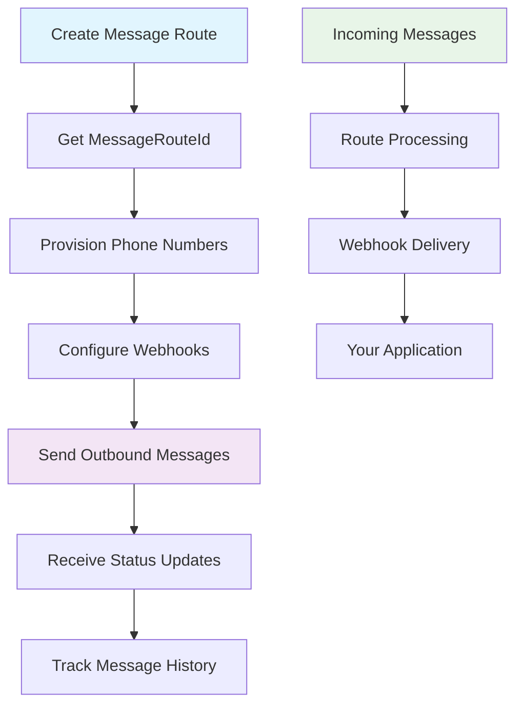

# Intelligent Messaging API

The **Intelligent Messaging API** provides comprehensive SMS and MMS messaging capabilities with advanced routing, delivery tracking, and multimedia support. Build powerful messaging applications with enterprise-grade reliability and detailed analytics.

## 🚀 Key Features

- **📱 SMS & MMS Support**: Send text messages and multimedia content
- **🔄 Message Routing**: Configure custom routing for incoming and outgoing messages  
- **📊 Delivery Tracking**: Real-time status updates and delivery confirmations
- **🎯 Campaign Management**: Track and organize messaging campaigns
- **🔗 Webhook Integration**: Receive real-time callbacks for message events
- **💰 Cost Transparency**: Detailed cost tracking for all messages
- **🌍 Global Reach**: Support for international messaging

## 📋 Available Endpoints

<div className="grid grid-cols-1 gap-6 mt-8">
  <div className="border border-accent/20 rounded-lg overflow-hidden">
    <div className="bg-accent/5 px-4 py-3 border-b border-accent/20">
      <h3 className="text-lg font-semibold flex items-center gap-2">
        📨 Message Operations
      </h3>
    </div>
    <div className="p-6 grid grid-cols-1 md:grid-cols-2 gap-6">
      <div className="space-y-3">
        <div className="flex items-center gap-3">
          <span className="bg-blue-500 text-white px-3 py-1 rounded-md text-sm font-semibold">POST</span>
          <span className="font-mono text-sm">/v1.0/message/outbound</span>
        </div>
        <p className="text-sm text-slate-600 dark:text-slate-400">Send SMS or MMS messages to one or more recipients with multimedia support</p>
        <a href="/docs/api-reference/intelligent-messaging/outbound-message" className="text-sm font-medium text-primary hover:underline inline-flex items-center gap-1">
          View Documentation →
        </a>
      </div>
      
      <div className="space-y-3">
        <div className="flex items-center gap-3">
          <span className="bg-green-500 text-white px-3 py-1 rounded-md text-sm font-semibold">GET</span>
          <span className="font-mono text-sm">/v1.0/message/details</span>
        </div>
        <p className="text-sm text-slate-600 dark:text-slate-400">Get comprehensive details and delivery status of a specific message</p>
        <a href="/docs/api-reference/intelligent-messaging/message-details" className="text-sm font-medium text-primary hover:underline inline-flex items-center gap-1">
          View Documentation →
        </a>
      </div>
      
      <div className="space-y-3">
        <div className="flex items-center gap-3">
          <span className="bg-green-500 text-white px-3 py-1 rounded-md text-sm font-semibold">GET</span>
          <span className="font-mono text-sm">/v1.0/message/search</span>
        </div>
        <p className="text-sm text-slate-600 dark:text-slate-400">Search message history by phone number with filtering options</p>
        <a href="/docs/api-reference/intelligent-messaging/message-search" className="text-sm font-medium text-primary hover:underline inline-flex items-center gap-1">
          View Documentation →
        </a>
      </div>
    </div>
  </div>
  
  <div className="border border-accent/20 rounded-lg overflow-hidden">
    <div className="bg-accent/5 px-4 py-3 border-b border-accent/20">
      <h3 className="text-lg font-semibold flex items-center gap-2">
        🛣️ Message Route Management
      </h3>
    </div>
    <div className="p-6 grid grid-cols-1 md:grid-cols-2 gap-6">
      <div className="space-y-3">
        <div className="flex items-center gap-3">
          <span className="bg-blue-500 text-white px-3 py-1 rounded-md text-sm font-semibold">POST</span>
          <span className="font-mono text-sm">/v1.0/message/routes</span>
        </div>
        <p className="text-sm text-slate-600 dark:text-slate-400">Create webhook configurations for handling incoming messages and callbacks</p>
        <a href="/docs/api-reference/intelligent-messaging/message-routes" className="text-sm font-medium text-primary hover:underline inline-flex items-center gap-1">
          View Documentation →
        </a>
      </div>
      
      <div className="space-y-3">
        <div className="flex items-center gap-3">
          <span className="bg-green-500 text-white px-3 py-1 rounded-md text-sm font-semibold">GET</span>
          <span className="font-mono text-sm">/v1.0/message/routes</span>
        </div>
        <p className="text-sm text-slate-600 dark:text-slate-400">Get detailed configuration of a specific message route</p>
        <a href="/docs/api-reference/intelligent-messaging/message-route-details" className="text-sm font-medium text-primary hover:underline inline-flex items-center gap-1">
          View Documentation →
        </a>
      </div>
      
      <div className="space-y-3">
        <div className="flex items-center gap-3">
          <span className="bg-blue-500 text-white px-3 py-1 rounded-md text-sm font-semibold">POST</span>
          <span className="font-mono text-sm">/v1.0/message/routes/update</span>
        </div>
        <p className="text-sm text-slate-600 dark:text-slate-400">Modify existing message route configurations</p>
        <a href="/docs/api-reference/intelligent-messaging/message-routes" className="text-sm font-medium text-primary hover:underline inline-flex items-center gap-1">
          View Documentation →
        </a>
      </div>
      
      <div className="space-y-3">
        <div className="flex items-center gap-3">
          <span className="bg-red-500 text-white px-3 py-1 rounded-md text-sm font-semibold">POST</span>
          <span className="font-mono text-sm">/v1.0/message/routes/delete</span>
        </div>
        <p className="text-sm text-slate-600 dark:text-slate-400">Permanently remove message route configurations</p>
        <a href="/docs/api-reference/intelligent-messaging/message-routes" className="text-sm font-medium text-primary hover:underline inline-flex items-center gap-1">
          View Documentation →
        </a>
      </div>
    </div>
  </div>
</div>

## 🔄 Integration Workflow



### Step-by-Step Integration

1. **🛣️ Create Message Route**
   ```bash
   POST /v1.0/message/routes
   ```
   - Configure webhook URLs for incoming messages
   - Set up authentication and callback URLs
   - Get a `MessageRouteId` for phone number association

2. **📱 Associate with Phone Numbers**
   - Use the `MessageRouteId` when provisioning numbers via Intelligent Mobile Numbers API
   - Configure how incoming and outgoing messages are processed

3. **📤 Send Messages**
   ```bash
   POST /v1.0/message/outbound
   ```
   - Send SMS or MMS from your enabled phone numbers
   - Support for multiple recipients and multimedia content

4. **📊 Track Delivery**
   ```bash
   GET /v1.0/message/details?MessageId={id}
   ```
   - Monitor message status and delivery confirmations
   - Receive real-time updates via configured webhooks

## 💡 Key Concepts

### Message Types

<div className="grid grid-cols-1 md:grid-cols-2 gap-4 mt-4">
  <div className="border border-accent/20 rounded-lg p-4">
    <h4 className="font-semibold text-blue-600 dark:text-blue-400 mb-2">📱 SMS Messages</h4>
    <ul className="text-sm space-y-1 text-slate-600 dark:text-slate-400">
      <li>• Text-only messages up to 160 characters</li>
      <li>• Automatic concatenation for longer messages</li>
      <li>• Lower cost and universal compatibility</li>
      <li>• Ideal for notifications and alerts</li>
    </ul>
  </div>
  
  <div className="border border-accent/20 rounded-lg p-4">
    <h4 className="font-semibold text-purple-600 dark:text-purple-400 mb-2">🖼️ MMS Messages</h4>
    <ul className="text-sm space-y-1 text-slate-600 dark:text-slate-400">
      <li>• Support for images, audio, and video</li>
      <li>• Media URLs or base64-encoded content</li>
      <li>• Rich messaging experiences</li>
      <li>• Perfect for marketing and engagement</li>
    </ul>
  </div>
</div>

### Message Routing

Message routes define how incoming messages are processed and where they're delivered:

- **🔗 Webhook URLs**: Receive incoming messages in real-time
- **🔐 Authentication**: Secure your endpoints with Basic or Bearer token auth
- **📞 Callback URLs**: Get delivery status updates and message events
- **⚙️ Route Configuration**: Customize processing logic per phone number

## 📊 Response Format

All Intelligent Messaging API responses use **PascalCase** property names for consistency:

```json
{
  "MessageId": "TMID-948AFE64-A7A9-45D4-A30A-DB7CFB57A2B6",
  "Direction": "OUTBOUND",
  "Type": "p2p",
  "CampaignId": "JCID-dsuhofh3882",
  "Cost": 0.0045,
  "Status": "Queued",
  "To": [
    {
      "Number": "+12016093801"
    }
  ],
  "From": "+18018018011",
  "Owner": "+18018018011",
  "Body": "Hello there!!!",
  "CreatedOn": "2025-01-28T17:42:41.9606287Z",
  "MessageType": "sms"
}
```

## 🛡️ Best Practices

### Security & Authentication
- Always use HTTPS for webhook URLs
- Implement proper authentication on your webhook endpoints
- Validate incoming webhook signatures
- Store API tokens securely

### Message Optimization
- Use E.164 format for all phone numbers (+12125551234)
- Keep MMS media files under 5MB for optimal delivery
- Include meaningful `CampaignId` values for tracking
- Monitor delivery status through callbacks

### Error Handling
- Implement retry logic for failed webhook deliveries
- Handle rate limiting gracefully
- Log message IDs for troubleshooting
- Monitor delivery rates and failure patterns

### Cost Management
- Track message costs using the `Cost` field in responses
- Use SMS for simple notifications to reduce costs
- Implement message deduplication to avoid duplicates
- Monitor usage patterns and optimize accordingly

## 🔗 Related APIs

- **[Authentication](/docs/api-reference/authentication)** - Get access tokens for API requests
- **[Intelligent Mobile Numbers](/docs/api-reference/intelligent-mobile-numbers)** - Provision and manage phone numbers
- **[Intelligent Voice](/docs/api-reference/intelligent-voice)** - Voice calling and SIP routing capabilities

---

Ready to start sending messages? Check out our [Quick Start Guide](/docs/get-started) or dive into the [Outbound Message API](/docs/api-reference/intelligent-messaging/outbound-message) documentation. 