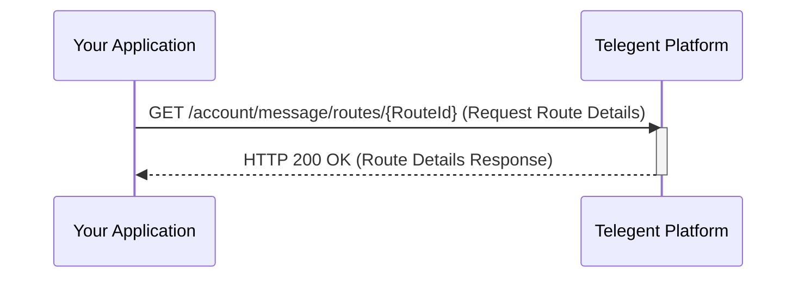

# Message Route Details

## GET /account/message/routes/{RouteId}

Retrieves detailed information about a specific message route using its unique RouteId. This endpoint provides comprehensive configuration details for the specified message route.

### Request

#### Headers

```
Authorization: Bearer {your_api_token}
```

#### Path Parameters

| Parameter | Type | Required | Description | Example |
| --- | --- | --- | --- | --- |
| `RouteId` | string | Yes | Unique identifier of the message route | `"MRID-ad0ff867-57dc-4aeb-80e9-9d18349080e9"` |

### Sample Request

```bash
curl -X GET "https://api.telegent.com/v1.0/account/message/routes/MRID-ad0ff867-57dc-4aeb-80e9-9d18349080e9" \
  -H "Authorization: Bearer YOUR_API_TOKEN"
```

### Response Body (200 OK)

The response will include the details of the message route in Pascal casing format.

```json
{
  "RouteId": "MRID-12345",
  "RouteName": "Main SMS Webhook",
  "RouteType": "Webhook",
  "SmsUrl": "https://apiendpoint.com",
  "SmsUrlMethod": "POST",
  "SmsRouteEnabled": true,
  "CallbackSmsUrl": "https://callbackendpoint.com",
  "CallbackSmsUrlMethod": "POST",
  "CreatedDate": "2024-01-29T10:30:00Z"
}
```

### Response Properties

| Property           | Type    | Description                                  |
|--------------------|---------|----------------------------------------------|
| `RouteId`          | string  | The unique identifier for the message route. |
| `RouteName`        | string  | The name of the message route.               |
| `RouteType`        | string  | The type of message route.                   |
| `SmsUrl`           | string  | The URL for handling SMS.                    |
| `SmsUrlMethod`     | string  | The HTTP method for SMS URL.                 |
| `SmsRouteEnabled`  | boolean | Indicates if the SMS route is enabled.       |
| `CallbackSmsUrl`   | string  | The URL for handling callback SMS.           |
| `CallbackSmsUrlMethod`| string| The HTTP method for callback SMS URL.        |
| `CreatedDate`      | string  | The timestamp when the route was created.    |

### Code Examples

#### Python

```python
import requests

route_id = "MRID-ad0ff867-57dc-4aeb-80e9-9d18349080e9"
url = f"https://api.telegent.com/v1.0/account/message/routes/{route_id}"

headers = {
    "Authorization": "Bearer YOUR_API_TOKEN"
}

try:
    response = requests.get(url, headers=headers)
    response.raise_for_status()

    route_details = response.json()
    print("Message Route Details:")
    print(f"Route ID: {route_details.get('RouteId')}")
    print(f"Route Name: {route_details.get('RouteName')}")
    print(f"Route Type: {route_details.get('RouteType')}")
    print(f"SMS URL: {route_details.get('SmsUrl')}")

except requests.exceptions.RequestException as e:
    print(f"Error retrieving message route details: {e}")
    if 'response' in locals():
        print(f"Response Body: {response.text}")
```

#### JavaScript

```javascript
const routeId = 'MRID-ad0ff867-57dc-4aeb-80e9-9d18349080e9';
const response = await fetch(`https://api.telegent.com/v1.0/account/message/routes/${routeId}`, {
  headers: {
    'Authorization': 'Bearer YOUR_API_TOKEN'
  }
});

const routeDetails = await response.json();
console.log('Route Details:', {
  routeId: routeDetails.RouteId,
  routeName: routeDetails.RouteName,
  routeType: routeDetails.RouteType,
  smsUrl: routeDetails.SmsUrl
});
```

### Message Route Details Flow

