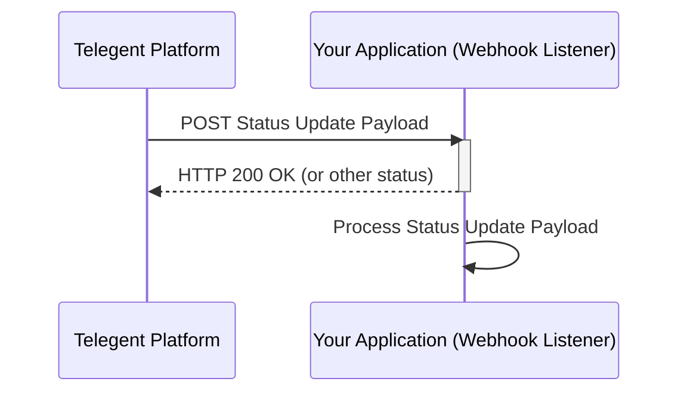

## Message Status Updates

This section describes how to receive and process message status updates via webhooks.

### Endpoint

Message status updates are typically received via a configured webhook URL on your application.

**Method:** `POST`

### Request Body

The structure of the status update payload received by your webhook will typically include:

```json
{
  "MessageId": "string",
  "Status": "string",
  "Timestamp": "string",
  "ErrorCode": "string",
  "ErrorMessage": "string"
  // ... other relevant fields
}
```

Possible `Status` values might include `queued`, `sent`, `delivered`, `failed`, etc.

### Processing Status Updates

Upon receiving a status update, your application should process the payload, typically updating the status of the corresponding message in your system. A successful receipt should generally return a `200 OK` response to the Telegent platform.

### Python Example (Webhook Listener - Flask)

This example shows a basic Flask application acting as a webhook listener for message status updates.

```python
from flask import Flask, request, json

app = Flask(__name__)

@app.route('/status-webhook', methods=['POST'])
def handle_status_update():
    """
    Handles incoming message status updates from the Telegent platform webhook.
    """
    try:
        status_payload = request.json
        print("Received Status Update:")
        print(json.dumps(status_payload, indent=2))

        # Process the status update here
        # e.g., update message status in database

        # Acknowledge successful receipt
        return "OK", 200

    except Exception as e:
        print(f"Error processing status update: {e}")
        # Return an error status if processing failed
        return "Internal Server Error", 500

if __name__ == '__main__':
    # Remember to use a production-ready WSGI server in production
    # Also, your application needs to be publicly accessible for the webhook to reach it
    app.run(port=5001, debug=True)
```

### Status Update Flow

Here is a diagram illustrating the flow of a status update:

