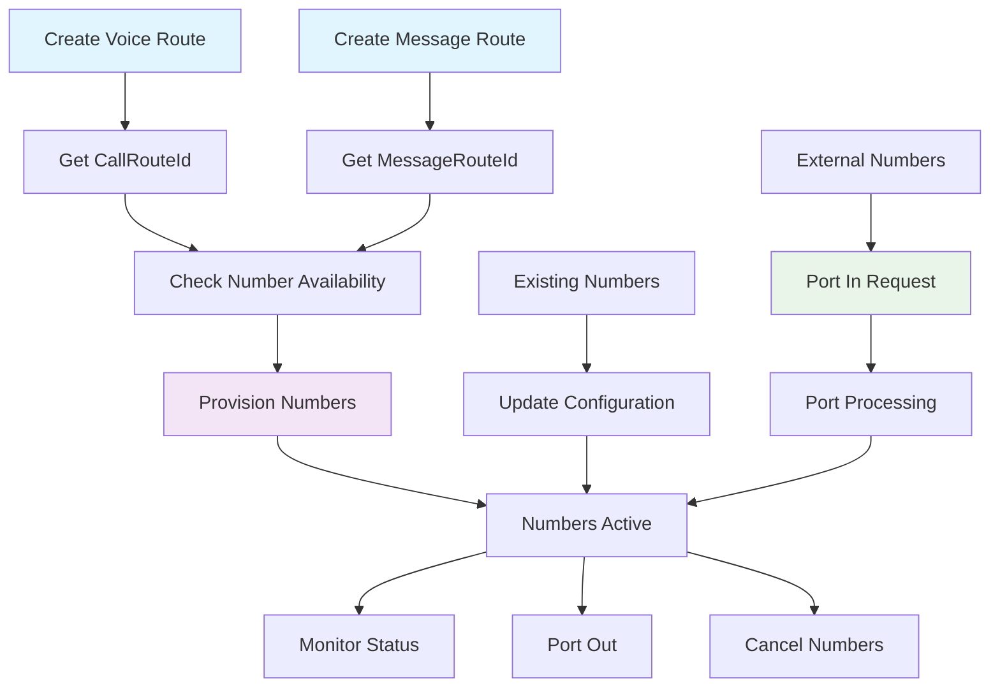

# Intelligent Mobile Numbers API

The **Intelligent Mobile Numbers API** provides comprehensive phone number lifecycle management, including provisioning, configuration, porting, and monitoring. Build powerful telecommunications applications with enterprise-grade number management capabilities.

## 🚀 Key Features

- **📱 Number Provisioning**: Purchase and configure new phone numbers instantly
- **🔄 Number Porting**: Seamlessly port numbers in and out of the platform
- **⚙️ Configuration Management**: Associate numbers with voice and messaging routes
- **📊 Inventory Management**: Track and monitor your number portfolio
- **🔍 Availability Search**: Find available numbers by area code, region, or pattern
- **📈 Order Tracking**: Monitor provisioning and porting order status
- **🛡️ Status Monitoring**: Real-time operational status for all numbers

## 🔄 Key Workflow

<div className="bg-blue-50 dark:bg-blue-900/20 border border-blue-200 dark:border-blue-800 rounded-lg p-4 mb-6">
  <h3 className="text-lg font-semibold text-blue-800 dark:text-blue-200 mb-3">⚠️ Important: Prerequisites for Number Configuration</h3>
  <p className="text-sm text-blue-700 dark:text-blue-300 mb-3">
    Before provisioning new numbers or updating existing ones with specific voice and messaging capabilities, perform these prerequisite steps:
  </p>
  <ol className="text-sm text-blue-700 dark:text-blue-300 space-y-2">
    <li><strong>1. Create a Voice Route</strong>: Use the Intelligent Voice API to get a <code>CallRouteId</code></li>
    <li><strong>2. Create a Message Route</strong>: Use the Intelligent Messaging API to get a <code>MessageRouteId</code></li>
    <li><strong>3. Use these IDs</strong>: Include both IDs when provisioning or updating numbers</li>
  </ol>
</div>



## 📋 Available Endpoints

<div className="grid grid-cols-1 gap-6 mt-8">
  <div className="border border-accent/20 rounded-lg overflow-hidden">
    <div className="bg-accent/5 px-4 py-3 border-b border-accent/20">
      <h3 className="text-lg font-semibold flex items-center gap-2">
        🔍 Number Discovery & Management
      </h3>
    </div>
    <div className="p-6 grid grid-cols-1 md:grid-cols-2 gap-6">
      <div className="space-y-3">
        <div className="flex items-center gap-3">
          <span className="bg-blue-500 text-white px-3 py-1 rounded-md text-sm font-semibold">POST</span>
          <span className="font-mono text-sm">/v1.0/numbers/availability</span>
        </div>
        <p className="text-sm text-slate-600 dark:text-slate-400">Check availability of phone numbers by criteria before provisioning</p>
        <a href="/docs/api-reference/intelligent-mobile-numbers/available-numbers" className="text-sm font-medium text-primary hover:underline inline-flex items-center gap-1">
          View Documentation →
        </a>
      </div>
      
      <div className="space-y-3">
        <div className="flex items-center gap-3">
          <span className="bg-green-500 text-white px-3 py-1 rounded-md text-sm font-semibold">GET</span>
          <span className="font-mono text-sm">/v1.0/numbers/inventory</span>
        </div>
        <p className="text-sm text-slate-600 dark:text-slate-400">Get your complete inventory of phone numbers with filtering options</p>
        <a href="/docs/api-reference/intelligent-mobile-numbers/number-inventory" className="text-sm font-medium text-primary hover:underline inline-flex items-center gap-1">
          View Documentation →
        </a>
      </div>
      
      <div className="space-y-3">
        <div className="flex items-center gap-3">
          <span className="bg-green-500 text-white px-3 py-1 rounded-md text-sm font-semibold">GET</span>
          <span className="font-mono text-sm">/v1.0/numbers</span>
        </div>
        <p className="text-sm text-slate-600 dark:text-slate-400">Retrieve detailed configuration and status for a specific phone number</p>
        <a href="/docs/api-reference/intelligent-mobile-numbers/number-details" className="text-sm font-medium text-primary hover:underline inline-flex items-center gap-1">
          View Documentation →
        </a>
      </div>
      
      <div className="space-y-3">
        <div className="flex items-center gap-3">
          <span className="bg-blue-500 text-white px-3 py-1 rounded-md text-sm font-semibold">POST</span>
          <span className="font-mono text-sm">/v1.0/numbers/status</span>
        </div>
        <p className="text-sm text-slate-600 dark:text-slate-400">Get current operational status of a specific number</p>
        <a href="/docs/api-reference/intelligent-mobile-numbers/number-details" className="text-sm font-medium text-primary hover:underline inline-flex items-center gap-1">
          View Documentation →
        </a>
      </div>
    </div>
  </div>
  
  <div className="border border-accent/20 rounded-lg overflow-hidden">
    <div className="bg-accent/5 px-4 py-3 border-b border-accent/20">
      <h3 className="text-lg font-semibold flex items-center gap-2">
        ⚙️ Number Provisioning & Configuration
      </h3>
    </div>
    <div className="p-6 grid grid-cols-1 md:grid-cols-2 gap-6">
      <div className="space-y-3">
        <div className="flex items-center gap-3">
          <span className="bg-blue-500 text-white px-3 py-1 rounded-md text-sm font-semibold">POST</span>
          <span className="font-mono text-sm">/v1.0/numbers/provision</span>
        </div>
        <p className="text-sm text-slate-600 dark:text-slate-400">Purchase and configure new phone numbers with voice and messaging routes</p>
        <a href="/docs/api-reference/intelligent-mobile-numbers/number-provision" className="text-sm font-medium text-primary hover:underline inline-flex items-center gap-1">
          View Documentation →
        </a>
      </div>
      
      <div className="space-y-3">
        <div className="flex items-center gap-3">
          <span className="bg-blue-500 text-white px-3 py-1 rounded-md text-sm font-semibold">POST</span>
          <span className="font-mono text-sm">/v1.0/numbers/update</span>
        </div>
        <p className="text-sm text-slate-600 dark:text-slate-400">Modify configuration of existing numbers including route assignments</p>
        <a href="/docs/api-reference/intelligent-mobile-numbers/numbers-update" className="text-sm font-medium text-primary hover:underline inline-flex items-center gap-1">
          View Documentation →
        </a>
      </div>
      
      <div className="space-y-3">
        <div className="flex items-center gap-3">
          <span className="bg-red-500 text-white px-3 py-1 rounded-md text-sm font-semibold">POST</span>
          <span className="font-mono text-sm">/v1.0/numbers/cancel</span>
        </div>
        <p className="text-sm text-slate-600 dark:text-slate-400">Cancel and release phone numbers from your account</p>
        <a href="/docs/api-reference/intelligent-mobile-numbers/numbers-cancel" className="text-sm font-medium text-primary hover:underline inline-flex items-center gap-1">
          View Documentation →
        </a>
      </div>
      
      <div className="space-y-3">
        <div className="flex items-center gap-3">
          <span className="bg-green-500 text-white px-3 py-1 rounded-md text-sm font-semibold">GET</span>
          <span className="font-mono text-sm">/v1.0/numbers/order</span>
        </div>
        <p className="text-sm text-slate-600 dark:text-slate-400">Track status and details of provisioning orders</p>
        <a href="/docs/api-reference/intelligent-mobile-numbers/order-details" className="text-sm font-medium text-primary hover:underline inline-flex items-center gap-1">
          View Documentation →
        </a>
      </div>
    </div>
  </div>
  
  <div className="border border-accent/20 rounded-lg overflow-hidden">
    <div className="bg-accent/5 px-4 py-3 border-b border-accent/20">
      <h3 className="text-lg font-semibold flex items-center gap-2">
        🔄 Number Porting
      </h3>
    </div>
    <div className="p-6 grid grid-cols-1 md:grid-cols-2 gap-6">
      <div className="space-y-3">
        <div className="flex items-center gap-3">
          <span className="bg-blue-500 text-white px-3 py-1 rounded-md text-sm font-semibold">POST</span>
          <span className="font-mono text-sm">/v1.0/numbers/portin</span>
        </div>
        <p className="text-sm text-slate-600 dark:text-slate-400">Port existing numbers from another carrier into your account</p>
        <a href="/docs/api-reference/intelligent-mobile-numbers/port-in" className="text-sm font-medium text-primary hover:underline inline-flex items-center gap-1">
          View Documentation →
        </a>
      </div>
      
      <div className="space-y-3">
        <div className="flex items-center gap-3">
          <span className="bg-blue-500 text-white px-3 py-1 rounded-md text-sm font-semibold">POST</span>
          <span className="font-mono text-sm">/v1.0/numbers/portout</span>
        </div>
        <p className="text-sm text-slate-600 dark:text-slate-400">Port your numbers out to another carrier</p>
        <a href="/docs/api-reference/intelligent-mobile-numbers/port-out" className="text-sm font-medium text-primary hover:underline inline-flex items-center gap-1">
          View Documentation →
        </a>
      </div>
    </div>
  </div>
</div>

## 💡 Key Concepts

### Number Lifecycle States

<div className="grid grid-cols-1 md:grid-cols-3 gap-4 mt-4">
  <div className="border border-accent/20 rounded-lg p-4">
    <h4 className="font-semibold text-green-600 dark:text-green-400 mb-2">🟢 Active Numbers</h4>
    <ul className="text-sm space-y-1 text-slate-600 dark:text-slate-400">
      <li>• Fully provisioned and operational</li>
      <li>• Ready for voice and messaging</li>
      <li>• Associated with configured routes</li>
      <li>• Billing active</li>
    </ul>
  </div>
  
  <div className="border border-accent/20 rounded-lg p-4">
    <h4 className="font-semibold text-yellow-600 dark:text-yellow-400 mb-2">🟡 Pending Numbers</h4>
    <ul className="text-sm space-y-1 text-slate-600 dark:text-slate-400">
      <li>• Provisioning in progress</li>
      <li>• Porting requests being processed</li>
      <li>• Configuration updates pending</li>
      <li>• Awaiting carrier activation</li>
    </ul>
  </div>
  
  <div className="border border-accent/20 rounded-lg p-4">
    <h4 className="font-semibold text-red-600 dark:text-red-400 mb-2">🔴 Inactive Numbers</h4>
    <ul className="text-sm space-y-1 text-slate-600 dark:text-slate-400">
      <li>• Cancelled or suspended</li>
      <li>• Failed provisioning attempts</li>
      <li>• Porting failures</li>
      <li>• Scheduled for release</li>
    </ul>
  </div>
</div>

### Route Configuration

Numbers must be associated with routes to enable functionality:

- **🎙️ Voice Routes (`CallRouteId`)**: Define how incoming calls are handled (SIP trunks, webhooks, forwarding)
- **💬 Message Routes (`MessageRouteId`)**: Configure SMS/MMS processing (webhook URLs, authentication, callbacks)
- **🔗 Route Association**: Numbers can have both voice and messaging routes for full functionality
- **⚙️ Dynamic Updates**: Routes can be changed after number provisioning

## 📊 Response Format

All Intelligent Mobile Numbers API responses use **PascalCase** property names for consistency:

```json
{
  "NumberType": "p2p",
  "PhoneNumber": "18015555555",
  "ProductId": "MVNO",
  "SmsEnabled": "Yes",
  "SmsUrl": "https://endpoint.com",
  "SmsUrlMethod": "POST",
  "VoiceEnabled": "Yes",
  "VoiceRouteId": "CRID-509de94f-79cc-429b-a317-2102654dabbb",
  "MessageRouteId": "MRID-ad0ff867-57dc-4aeb-80e9-9d18349080e9",
  "Status": "Active",
  "CreatedOn": "2025-01-28T17:42:41.9606287Z"
}
```

## 🛡️ Best Practices

### Pre-Provisioning Setup
- Always create voice and message routes before provisioning numbers
- Test route configurations with existing numbers before scaling
- Document route IDs for consistent number configuration
- Plan number allocation strategy based on use cases

### Number Management
- Use meaningful naming conventions for route identification
- Monitor order status for provisioning requests
- Implement proper error handling for failed provisions
- Track number inventory regularly for cost optimization

### Porting Considerations
- Verify account information accuracy before porting
- Allow sufficient time for carrier processing
- Monitor port status throughout the process
- Have backup communication plans during porting

### Cost Optimization
- Cancel unused numbers promptly to avoid charges
- Use inventory filtering to identify underutilized numbers
- Plan number provisioning based on actual demand
- Monitor usage patterns for optimization opportunities

## 🔗 Integration Examples

### Basic Number Provisioning Flow

```javascript
// 1. Create routes first
const voiceRoute = await createVoiceRoute({
  RouteName: "Main SIP Trunk",
  RouteType: "Trunk",
  // ... voice configuration
});

const messageRoute = await createMessageRoute({
  RouteName: "Main SMS Webhook",
  MessageUrl: "https://your-app.com/webhooks/sms",
  // ... messaging configuration
});

// 2. Check availability
const availability = await checkAvailability({
  AreaCode: "801",
  Quantity: 5
});

// 3. Provision numbers with routes
const order = await provisionNumbers({
  PhoneNumbers: availability.AvailableNumbers.slice(0, 2),
  CallRouteId: voiceRoute.CallRouteId,
  MessageRouteId: messageRoute.MessageRouteId,
  SmsEnabled: "Yes",
  VoiceEnabled: "Yes"
});

// 4. Monitor order status
const orderStatus = await getOrderDetails({
  OrderId: order.OrderId
});
```

## 🔗 Related APIs

- **[Authentication](/docs/api-reference/authentication)** - Get access tokens for API requests
- **[Intelligent Voice](/docs/api-reference/intelligent-voice)** - Create voice routes for number configuration
- **[Intelligent Messaging](/docs/api-reference/intelligent-messaging)** - Create message routes for SMS/MMS functionality

---

Ready to start managing phone numbers? Check out our [Quick Start Guide](/docs/get-started) or dive into [Number Provisioning](/docs/api-reference/intelligent-mobile-numbers/number-provision) documentation. 