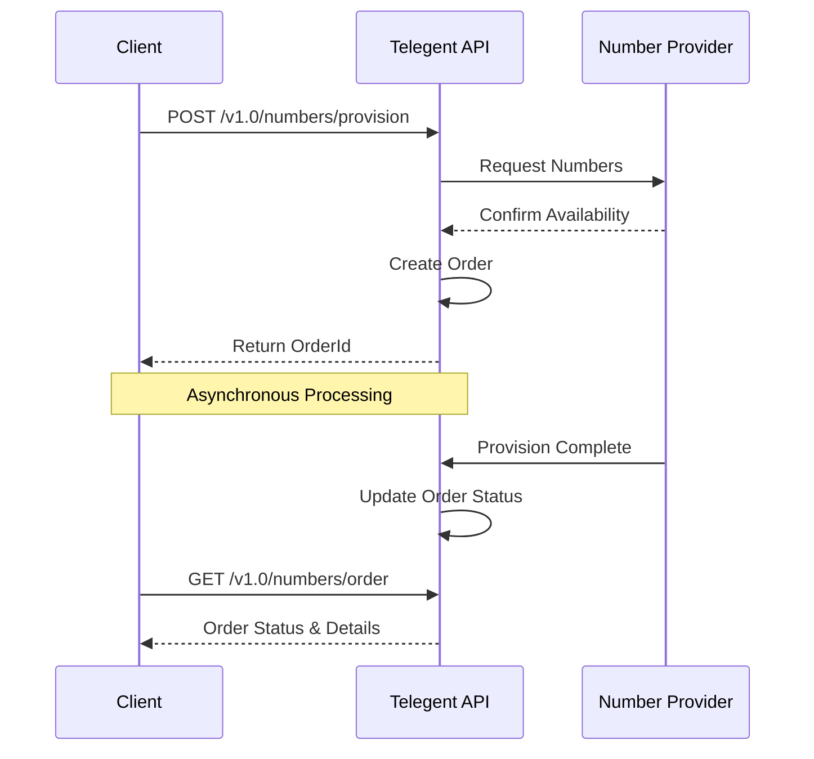

# Provision Numbers

## POST /numbers/provision

Provisions phone numbers with specified voice and messaging capabilities. This endpoint allows you to purchase and configure multiple phone numbers in a single request.

> **Prerequisites**: Before provisioning numbers, ensure you have created the necessary voice and message routes using the Intelligent Voice and Intelligent Messaging APIs.

### Request

#### Headers

```
Content-Type: application/json
Authorization: Bearer {your_api_token}
```

#### Body Parameters

| Parameter | Type | Required | Description | Example |
| --- | --- | --- | --- | --- |
| `NumberType` | string | Yes | Type of phone number. Valid values: `p2p`, `tollfree` | `"p2p"` |
| `PhoneNumbers` | array | Yes | Array of phone number objects to provision | `[{"Number": "+12015551234"}]` |
| `SmsEnabled` | string | Yes | Enable SMS functionality. Valid values: `Yes`, `No` | `"Yes"` |
| `VoiceEnabled` | string | Yes | Enable voice functionality. Valid values: `Yes`, `No` | `"Yes"` |
| `CallRouteId` | string | No* | Voice route ID for call handling. *Required if VoiceEnabled is "Yes" | `"CRID-509de94f-79cc-429b-a317-2102654dabbb"` |
| `MessageRouteId` | string | No* | Message route ID for SMS/MMS handling. *Required if SmsEnabled is "Yes" | `"MRID-ad0ff867-57dc-4aeb-80e9-9d18349080e9"` |

### Sample Request

```json
{
  "NumberType": "p2p",
  "PhoneNumbers": [
    {"Number": "+12015551234"},
    {"Number": "+12015551235"},
    {"Number": "+12015551236"}
  ],
  "SmsEnabled": "Yes",
  "VoiceEnabled": "Yes",
  "CallRouteId": "CRID-509de94f-79cc-429b-a317-2102654dabbb",
  "MessageRouteId": "MRID-ad0ff867-57dc-4aeb-80e9-9d18349080e9"
}
```

### Responses

#### 200 OK: Success

Returns details about the provisioning order that was created.

```json
{
  "OrderDate": "2025-01-28T17:42:41.9606287Z",
  "OrderId": "JNOID-6cba852c-b930-41b2-872f-bec5420bb13b",
  "OrderStatus": "Submitted",
  "PhoneNumbersRequested": [
    {"Number": "+12015551234"},
    {"Number": "+12015551235"},
    {"Number": "+12015551236"}
  ]
}
```

##### Response Fields

| Field | Type | Description |
| --- | --- | --- |
| `OrderDate` | string | Timestamp when the order was created (ISO 8601 format) |
| `OrderId` | string | Unique identifier for the provisioning order |
| `OrderStatus` | string | Current status of the order. Values: `Submitted`, `Processing`, `Completed`, `Failed` |
| `PhoneNumbersRequested` | array | List of phone numbers that were requested for provisioning |

#### 400 Bad Request: Validation Error

```json
{
  "Type": "https://tools.ietf.org/html/rfc7231#section-6.5.1",
  "Title": "One or more validation errors occurred.",
  "Status": 400,
  "Errors": {
    "$.PhoneNumbers": ["At least one phone number must be provided"],
    "$.CallRouteId": ["CallRouteId is required when VoiceEnabled is Yes"]
  },
  "TraceId": "00-1234abcd5678efgh-abcdef123456-00"
}
```

#### 401 Unauthorized: Authentication Error

```json
{
  "Type": "https://tools.ietf.org/html/rfc7235#section-3.1",
  "Title": "Unauthorized",
  "Status": 401,
  "TraceId": "00-1234abcd5678efgh-abcdef123456-00"
}
```

### Usage Notes

- **Route Prerequisites**: Ensure you have created voice and message routes before provisioning numbers. Use the route IDs in your provisioning request.
- **Number Availability**: Check number availability using the `/numbers/availability` endpoint before attempting to provision.
- **Asynchronous Processing**: Number provisioning is asynchronous. Use the returned `OrderId` to track progress via the `/numbers/order` endpoint.
- **Billing**: Provisioned numbers will begin billing immediately upon successful provisioning.
- **Batch Provisioning**: You can provision multiple numbers in a single request for efficiency.

### Code Examples

#### cURL

```bash
curl -X POST https://api.telegent.com/v1.0/numbers/provision \
  -H "Content-Type: application/json" \
  -H "Authorization: Bearer YOUR_API_TOKEN" \
  -d '{
    "NumberType": "p2p",
    "PhoneNumbers": [
      {"Number": "+12015551234"},
      {"Number": "+12015551235"}
    ],
    "SmsEnabled": "Yes",
    "VoiceEnabled": "Yes",
    "CallRouteId": "CRID-509de94f-79cc-429b-a317-2102654dabbb",
    "MessageRouteId": "MRID-ad0ff867-57dc-4aeb-80e9-9d18349080e9"
  }'
```

#### Python

```python
import requests
import json

url = "https://api.telegent.com/v1.0/numbers/provision"

payload = {
    "NumberType": "p2p",
    "PhoneNumbers": [
        {"Number": "+12015551234"},
        {"Number": "+12015551235"}
    ],
    "SmsEnabled": "Yes",
    "VoiceEnabled": "Yes",
    "CallRouteId": "CRID-509de94f-79cc-429b-a317-2102654dabbb",
    "MessageRouteId": "MRID-ad0ff867-57dc-4aeb-80e9-9d18349080e9"
}

headers = {
    "Content-Type": "application/json",
    "Authorization": "Bearer YOUR_API_TOKEN"
}

response = requests.post(url, headers=headers, json=payload)
data = response.json()

print(f"Order ID: {data['OrderId']}")
print(f"Status: {data['OrderStatus']}")
```

#### JavaScript

```javascript
const response = await fetch('https://api.telegent.com/v1.0/numbers/provision', {
  method: 'POST',
  headers: {
    'Content-Type': 'application/json',
    'Authorization': 'Bearer YOUR_API_TOKEN'
  },
  body: JSON.stringify({
    NumberType: 'p2p',
    PhoneNumbers: [
      { Number: '+12015551234' },
      { Number: '+12015551235' }
    ],
    SmsEnabled: 'Yes',
    VoiceEnabled: 'Yes',
    CallRouteId: 'CRID-509de94f-79cc-429b-a317-2102654dabbb',
    MessageRouteId: 'MRID-ad0ff867-57dc-4aeb-80e9-9d18349080e9'
  })
});

const data = await response.json();
console.log('Order ID:', data.OrderId);
```

## Provisioning Flow

The following diagram illustrates the number provisioning process:

<div className="my-6">

</div>

## Related Endpoints

- [Available Numbers](/api-reference/intelligent-mobile-numbers/available-numbers) - Check number availability
- [Order Details](/api-reference/intelligent-mobile-numbers/order-details) - Check order status
- [Numbers Update](/api-reference/intelligent-mobile-numbers/numbers-update) - Update provisioned numbers