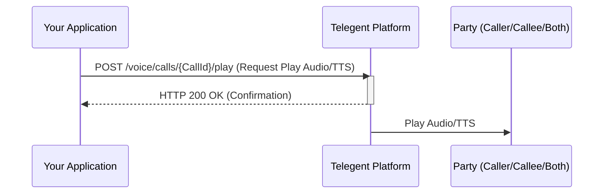

## Play Audio / Text-to-Speech

This endpoint allows you to play an audio file or convert text to speech and play it to one or both parties in an ongoing call.

### Endpoint

`/voice/calls/{CallId}/play`

**Method:** `POST`

### Path Parameters

| Parameter | Type   | Description                         | Required |
|-----------|--------|-------------------------------------|----------|
| `CallId`  | string | The unique identifier of the call. | Yes      |

### Request Body

| Parameter     | Type    | Description                                                | Required |
|---------------|---------|------------------------------------------------------------|----------|
| `AudioUrl`    | string  | URL of the audio file to play. Mutually exclusive with `Text`. | No       |
| `Text`        | string  | Text to be converted to speech and played. Mutually exclusive with `AudioUrl`. | No       |
| `Loop`        | integer | Number of times to loop the audio/TTS. Defaults to 1.     | No       |
| `Target`      | string  | The target party to play the audio to (`caller`, `callee`, or `both`). Defaults to `both`. | No       |
| `Voice`       | string  | The voice to use for Text-to-Speech (e.g., `alice`, `male`, `female`). Required if `Text` is used. | No       |

```json
{
  "Text": "Please wait while we connect your call.",
  "Voice": "alice",
  "Target": "caller"
}
```

OR

```json
{
  "AudioUrl": "https://your-app.com/audio/hold_music.mp3",
  "Loop": 5
}
```

### Response Body (200 OK)

A successful request will typically return a `200 OK` response confirming the action.

```json
{
  "Message": "Play action initiated successfully",
  "CallId": "call_12345abcde"
}
```

### Python Example (Playing Text-to-Speech)

```python
import requests

call_id = "call_12345abcde"
url = f"https://api.telegent.com/voice/calls/{call_id}/play"

headers = {
    "Authorization": "Bearer YOUR_ACCESS_TOKEN",
    "Content-Type": "application/json"
}

payload = {
    "Text": "Your call is important to us.",
    "Voice": "female",
    "Target": "both"
}

try:
    response = requests.post(url, headers=headers, json=payload)
    response.raise_for_status() # Raise an exception for bad status codes

    play_status = response.json()
    print("Play Action Status:")
    print(f"Call Id: {play_status.get('CallId')}")
    print(f"Message: {play_status.get('Message')}")

except requests.exceptions.RequestException as e:
    print(f"Error initiating play action: {e}")
    if response is not None:
        print(f"Response Body: {response.text}")
```

### Play Audio/TTS Flow

