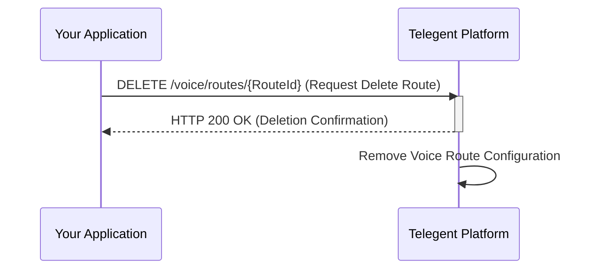

## Delete Voice Route

This endpoint allows you to delete an existing voice route.

### Endpoint

`/voice/routes/{RouteId}`

**Method:** `DELETE`

### Path Parameters

| Parameter | Type   | Description                         | Required |
|-----------|--------|-------------------------------------|----------|
| `RouteId`  | string | The unique identifier of the voice route to delete. | Yes      |

### Response Body (200 OK)

A successful deletion request will typically return a `200 OK` response confirming the deletion.

```json
{
  "Message": "Voice route deleted successfully",
  "RouteId": "VRID-abcxyz"
}
```

### Python Example

```python
import requests

RouteId = "VRID-abcxyz"
url = f"https://api.telegent.com/voice/routes/{RouteId}"

headers = {
    "Authorization": "Bearer YOUR_ACCESS_TOKEN"
}

try:
    response = requests.delete(url, headers=headers)
    response.raise_for_status() # Raise an exception for bad status codes

    delete_status = response.json()
    print("Delete Voice Route Status:")
    print(f"Route Id: {delete_status.get('RouteId')}")
    print(f"Message: {delete_status.get('Message')}")

except requests.exceptions.RequestException as e:
    print(f"Error deleting voice route: {e}")
    if response is not None:
        print(f"Response Body: {response.text}")
```

### Delete Voice Route Flow

