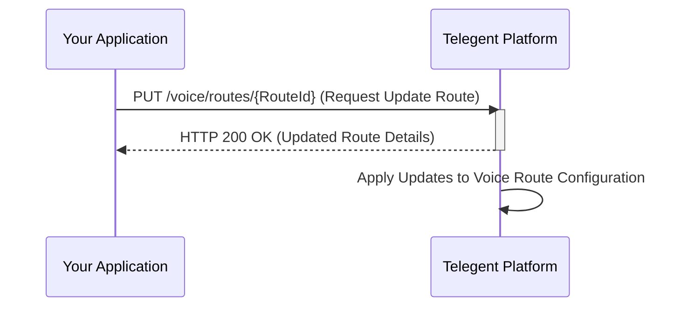

## Update Voice Route

This endpoint allows you to update an existing voice route configuration.

### Endpoint

`/voice/routes/{RouteId}`

**Method:** `PUT`

### Path Parameters

| Parameter | Type   | Description                         | Required |
|-----------|--------|-------------------------------------|----------|
| `RouteId`  | string | The unique identifier of the voice route to update. | Yes      |

### Request Body

| Parameter         | Type   | Description                                                              | Required |
|-------------------|--------|--------------------------------------------------------------------------|----------|
| `RouteName`       | string | Update the descriptive name for the voice route.                         | No       |
| `InboundUrl`      | string | Update the URL for handling inbound calls (if RouteType is Webhook).     | No       |
| `InboundUrlMethod`| string| Update the HTTP method for the `InboundUrl`.                             | No       |
| `TransferNumber`  | string | Update the phone number to transfer calls to (if RouteType is Transfer). | No       |

You should include only the parameters you wish to update.

```json
{
  "RouteName": "Updated Inbound Call Webhook",
  "InboundUrl": "https://your-app.com/updated-voice-webhook"
}
```

OR to update a Transfer route:

```json
{
  "TransferNumber": "+15551112222"
}
```

### Response Body (200 OK)

A successful update request will typically return a `200 OK` response with the updated details of the route.

```json
{
  "RouteId": "VRID-abcxyz",
  "RouteName": "Updated Inbound Call Webhook",
  "RouteType": "Webhook",
  "InboundUrl": "https://your-app.com/updated-voice-webhook",
  "InboundUrlMethod": "POST",
  "CreatedDate": "2023-11-02T10:00:00Z"
}
```

### Response Properties

| Property         | Type   | Description                                     |
|------------------|--------|------------------------------------------------|
| `RouteId`        | string | Unique identifier for the voice route.          |
| `RouteName`      | string | The updated name of the voice route.            |
| `RouteType`      | string | The type of voice route (remains unchanged).    |
| `InboundUrl`     | string | The updated URL for handling inbound calls.     |
| `InboundUrlMethod`| string| The updated HTTP method for the InboundUrl.     |
| `TransferNumber` | string | The updated phone number to transfer calls to.  |
| `CreatedDate`    | string | Timestamp when the route was created.           |

### Python Example

```python
import requests

route_id = "VRID-abcxyz"
url = f"https://api.telegent.com/voice/routes/{route_id}"

headers = {
    "Authorization": "Bearer YOUR_ACCESS_TOKEN",
    "Content-Type": "application/json"
}

payload = {
  "RouteName": "Customer Service IVR (Updated)",
  "InboundUrl": "https://your-app.com/updated-ivr-webhook"
}

try:
    response = requests.put(url, headers=headers, json=payload)
    response.raise_for_status() # Raise an exception for bad status codes

    updated_route = response.json()
    print("Voice Route updated successfully:")
    print(f"Route ID: {updated_route.get('RouteId')}")
    print(f"Updated Name: {updated_route.get('RouteName')}")
    print(f"Updated URL: {updated_route.get('InboundUrl')}")

except requests.exceptions.RequestException as e:
    print(f"Error updating voice route: {e}")
    if response is not None:
        print(f"Response Body: {response.text}")
```

### Update Voice Route Flow

