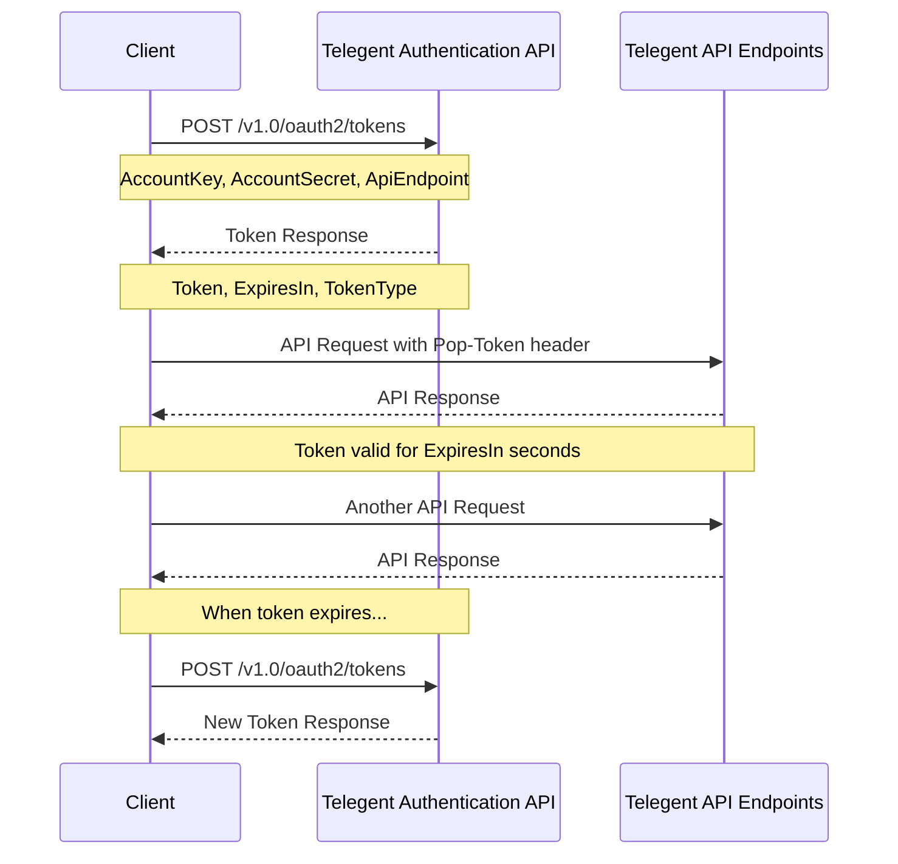

# Authentication

Telegent APIs use token-based authentication for secure access. You must obtain an access token before making requests to protected endpoints.

## API Token Endpoint

<div className="mt-4 border border-accent/20 rounded-md overflow-hidden">
  <div className="bg-accent/5 px-4 py-2 border-b border-accent/20 flex justify-between items-center">
    <div className="flex items-center gap-2">
      <span className="bg-blue-500 text-white px-2 py-0.5 rounded-md text-xs font-semibold">POST</span>
      <span className="font-mono text-sm">/v1.0/oauth2/tokens</span>
    </div>
    <span className="text-xs font-medium text-slate-500">Request Authentication Token</span>
  </div>
  <div className="p-4">
    <p className="text-sm mb-4">This endpoint generates an access token for authenticating with other API endpoints.</p>
    
    <div className="mb-6">
      <h4 className="text-sm font-semibold mb-2">Request Body</h4>
      <div className="bg-slate-50 dark:bg-slate-800/50 rounded-md p-3 overflow-x-auto">
```json
{
  "AccountKey": "DID-1e8939ab-3f3c-4db1-89d7-956d80fd793j",
  "AccountSecret": "cfmtvVERgKcdqKZZTwIjF4S",
  "ApiEndpoint": "https://api.telegent.com/v1.0/message/routes"
}
```
      </div>
    </div>
    
    <div className="mb-6">
      <h4 className="text-sm font-semibold mb-2">Parameters</h4>
      <table className="min-w-full text-sm">
        <thead>
          <tr className="border-b border-accent/20">
            <th className="text-left py-2 font-semibold">Parameter</th>
            <th className="text-left py-2 font-semibold">Type</th>
            <th className="text-left py-2 font-semibold">Description</th>
            <th className="text-left py-2 font-semibold">Required</th>
          </tr>
        </thead>
        <tbody>
          <tr className="border-b border-accent/10">
            <td className="py-2 font-mono">AccountKey</td>
            <td className="py-2">String</td>
            <td className="py-2">Your unique Telegent account identifier</td>
            <td className="py-2">Yes</td>
          </tr>
          <tr className="border-b border-accent/10">
            <td className="py-2 font-mono">AccountSecret</td>
            <td className="py-2">String</td>
            <td className="py-2">Your account secret key</td>
            <td className="py-2">Yes</td>
          </tr>
          <tr className="border-b border-accent/10">
            <td className="py-2 font-mono">ApiEndpoint</td>
            <td className="py-2">String</td>
            <td className="py-2">The API endpoint you intend to access</td>
            <td className="py-2">Yes</td>
          </tr>
        </tbody>
      </table>
    </div>

    <div className="mb-6">
      <h4 className="text-sm font-semibold mb-2">Response</h4>
      <p className="text-sm mb-2">A successful request returns a JSON object containing the access token and related details.</p>
      <div className="bg-slate-50 dark:bg-slate-800/50 rounded-md p-3 overflow-x-auto">
```json
{
  "Token": "eyJhbGciOiJIUzI1NiIsInR5cCI6IkpXVCJ9...",
  "ExpiresIn": 3600,
  "TokenType": "Bearer"
}
```
      </div>
    </div>

    <div className="mb-6">
      <h4 className="text-sm font-semibold mb-2">Python Example</h4>
      <div className="bg-slate-50 dark:bg-slate-800/50 rounded-md p-3 overflow-x-auto">
```python
import requests
import json

url = "https://api.telegent.com/v1.0/oauth2/tokens"

payload = json.dumps({
  "AccountKey": "DID-1e8939ab-3f3c-4db1-89d7-956d80fd793j",
  "AccountSecret": "cfmtvVERgKcdqKZZTwIjF4S",
  "ApiEndpoint": "https://api.telegent.com/v1.0/message/routes"
})
headers = {
  'Content-Type': 'application/json'
}

response = requests.request("POST", url, headers=headers, data=payload)

print(response.text)
```
      </div>
    </div>
    
    <div className="rounded-md bg-blue-50 dark:bg-blue-900/20 border border-blue-200 dark:border-blue-700 p-4">
      <div className="flex">
        <div className="flex-shrink-0">
          <svg className="h-5 w-5 text-blue-400" viewBox="0 0 20 20" fill="currentColor">
            <path fillRule="evenodd" d="M18 10a8 8 0 11-16 0 8 8 0 0116 0zm-7-4a1 1 0 11-2 0 1 1 0 012 0zM9 9a1 1 0 000 2v3a1 1 0 001 1h1a1 1 0 100-2v-3a1 1 0 00-1-1H9z" clipRule="evenodd" />
          </svg>
        </div>
        <div className="ml-3">
          <h3 className="text-sm font-medium text-blue-800 dark:text-blue-200">Important Note</h3>
          <div className="mt-2 text-sm text-blue-700 dark:text-blue-300">
            <p>
              Keep your AccountKey and AccountSecret secure. Do not expose these values in client-side code.
            </p>
          </div>
        </div>
      </div>
    </div>
  </div>
</div>


## Token Expiration

Tokens are valid for a limited time (typically 3600 seconds or 1 hour). After expiration, you'll need to request a new token.

## Authentication Flow

<div className="my-6">

</div>

## Error Responses

If authentication fails, you'll receive an error response with details about the issue:

```json
{
  "Type": "https://tools.ietf.org/html/rfc7235#section-3.1",
  "Title": "Unauthorized",
  "Status": 401,
  "Errors": {
    "Auth": ["Invalid credentials provided"]
  },
  "TraceId": "0HMMLJK38TNP1:00000001"
}
```

Common error codes:
- **401 Unauthorized**: Invalid credentials
- **403 Forbidden**: Valid credentials but insufficient permissions
- **429 Too Many Requests**: Rate limit exceeded 