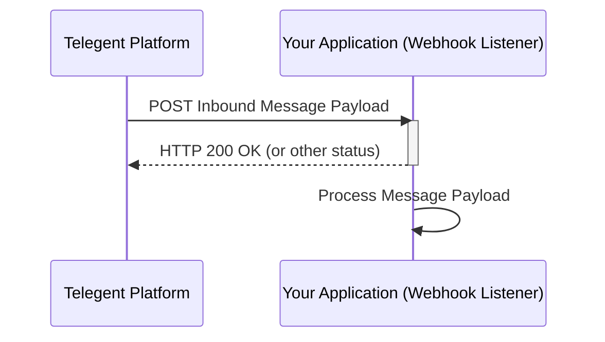

## Inbound Message

This section describes how to receive and process inbound messages via webhooks.

### Endpoint

Inbound messages are typically received via a configured webhook URL on your application.

**Method:** `POST`

### Request Body

The structure of the inbound message payload received by your webhook will vary depending on the message type (e.g., SMS, MMS). A typical payload might include:

```json
{
  "MessageId": "string",
  "From": "string",
  "To": "string",
  "Text": "string",
  "Timestamp": "string",
  "Direction": "inbound"
  // ... other relevant fields
}
```

### Processing the Inbound Message

Upon receiving an inbound message, your application should process the payload according to its business logic. A successful receipt should typically return a `200 OK` response to the Telegent platform.

### Python Example (Webhook Listener - Flask)

This example shows a basic Flask application acting as a webhook listener for inbound messages.

```python
from flask import Flask, request, json

app = Flask(__name__)

@app.route('/webhook', methods=['POST'])
def handle_inbound_message():
    """
    Handles incoming inbound messages from the Telegent platform webhook.
    """
    try:
        message_payload = request.json
        print("Received Inbound Message:")
        print(json.dumps(message_payload, indent=2))

        # Process the message payload here
        # e.g., store in a database, forward, trigger actions

        # Acknowledge successful receipt
        return "OK", 200

    except Exception as e:
        print(f"Error processing inbound message: {e}")
        # Return an error status if processing failed
        return "Internal Server Error", 500

if __name__ == '__main__':
    # Remember to use a production-ready WSGI server in production
    # Also, your application needs to be publicly accessible for the webhook to reach it
    app.run(port=5000, debug=True)
```

### Inbound Message Flow

Here is a diagram illustrating the flow of an inbound message:

