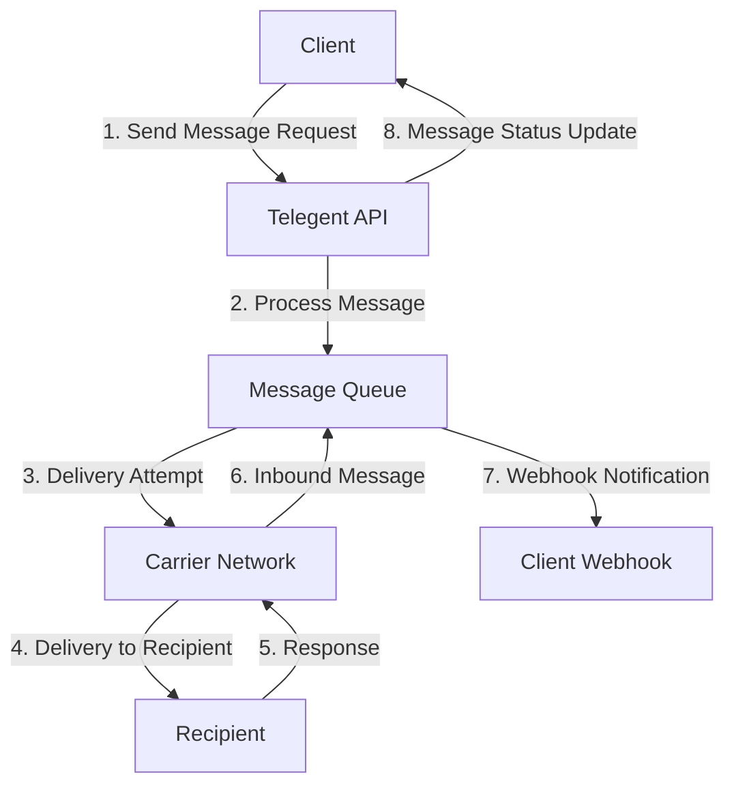

# Intelligent Messaging

The Intelligent Messaging API allows you to send and receive messages, manage message routes, and search message history.

## Available Endpoints

<div className="grid grid-cols-1 gap-4 mt-6">
  <div className="border border-accent/20 rounded-lg overflow-hidden">
    <div className="bg-accent/5 px-4 py-2 border-b border-accent/20">
      <h3 className="text-base font-medium">Message Management</h3>
    </div>
    <div className="p-4 grid grid-cols-1 md:grid-cols-2 gap-4">
      <div>
        <div className="flex items-center gap-2">
          <span className="bg-blue-500 text-white px-2 py-0.5 rounded-md text-xs font-semibold">POST</span>
          <span className="font-mono text-sm">/v1.0/message/outbound</span>
        </div>
        <p className="text-sm mt-1 text-slate-600 dark:text-slate-400">Send outbound messages</p>
        <a href="/api-reference/intelligent-messaging/outbound-message" className="text-xs font-medium text-primary mt-2 inline-block hover:underline">View Documentation →</a>
      </div>
      
      <div>
        <div className="flex items-center gap-2">
          <span className="bg-green-500 text-white px-2 py-0.5 rounded-md text-xs font-semibold">GET</span>
          <span className="font-mono text-sm">/v1.0/message/details</span>
        </div>
        <p className="text-sm mt-1 text-slate-600 dark:text-slate-400">Get details of a specific message</p>
        <a href="/api-reference/intelligent-messaging/message-details" className="text-xs font-medium text-primary mt-2 inline-block hover:underline">View Documentation →</a>
      </div>
      
      <div>
        <div className="flex items-center gap-2">
          <span className="bg-green-500 text-white px-2 py-0.5 rounded-md text-xs font-semibold">GET</span>
          <span className="font-mono text-sm">/v1.0/message/search</span>
        </div>
        <p className="text-sm mt-1 text-slate-600 dark:text-slate-400">Search for messages</p>
        <a href="/api-reference/intelligent-messaging/message-search" className="text-xs font-medium text-primary mt-2 inline-block hover:underline">View Documentation →</a>
      </div>
    </div>
  </div>
  
  <div className="border border-accent/20 rounded-lg overflow-hidden">
    <div className="bg-accent/5 px-4 py-2 border-b border-accent/20">
      <h3 className="text-base font-medium">Message Routes</h3>
    </div>
    <div className="p-4 grid grid-cols-1 md:grid-cols-2 gap-4">
      <div>
        <div className="flex items-center gap-2">
          <span className="bg-green-500 text-white px-2 py-0.5 rounded-md text-xs font-semibold">GET</span>
          <span className="font-mono text-sm">/v1.0/message/routes</span>
        </div>
        <p className="text-sm mt-1 text-slate-600 dark:text-slate-400">Get details of a message route</p>
        <a href="/api-reference/intelligent-messaging/message-routes" className="text-xs font-medium text-primary mt-2 inline-block hover:underline">View Documentation →</a>
      </div>
      
      <div>
        <div className="flex items-center gap-2">
          <span className="bg-blue-500 text-white px-2 py-0.5 rounded-md text-xs font-semibold">POST</span>
          <span className="font-mono text-sm">/v1.0/message/routes</span>
        </div>
        <p className="text-sm mt-1 text-slate-600 dark:text-slate-400">Create a new message route</p>
        <a href="/api-reference/intelligent-messaging/message-routes-create" className="text-xs font-medium text-primary mt-2 inline-block hover:underline">View Documentation →</a>
      </div>
      
      <div>
        <div className="flex items-center gap-2">
          <span className="bg-blue-500 text-white px-2 py-0.5 rounded-md text-xs font-semibold">POST</span>
          <span className="font-mono text-sm">/v1.0/message/routes/update</span>
        </div>
        <p className="text-sm mt-1 text-slate-600 dark:text-slate-400">Update an existing message route</p>
        <a href="/api-reference/intelligent-messaging/message-routes-update" className="text-xs font-medium text-primary mt-2 inline-block hover:underline">View Documentation →</a>
      </div>
      
      <div>
        <div className="flex items-center gap-2">
          <span className="bg-blue-500 text-white px-2 py-0.5 rounded-md text-xs font-semibold">POST</span>
          <span className="font-mono text-sm">/v1.0/message/routes/delete</span>
        </div>
        <p className="text-sm mt-1 text-slate-600 dark:text-slate-400">Delete a message route</p>
        <a href="/api-reference/intelligent-messaging/message-routes-delete" className="text-xs font-medium text-primary mt-2 inline-block hover:underline">View Documentation →</a>
      </div>
    </div>
  </div>
</div>

## Messaging Flow

The following diagram illustrates how messages flow through the Telegent platform:

<div className="my-6">

</div>

## Response Format

All responses from the Intelligent Messaging API use PascalCase property names. Here's an example response from the outbound message endpoint:

```json
{
  "MessageId": "MSG123456789",
  "Status": "Queued",
  "RecipientCount": 2,
  "CreatedOn": "2024-01-28T17:42:41.9606287Z"
}
```

## Authentication

All Intelligent Messaging API endpoints require authentication. Include your Pop-Token in the request headers:

```
Pop-Token: YOUR_TOKEN_HERE
```

See the [Authentication](/api-reference/authentication) section for details on obtaining an access token. 