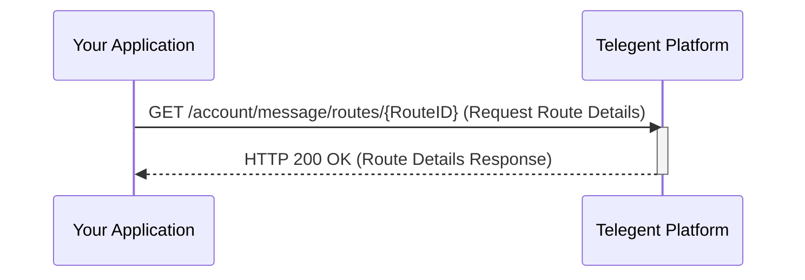

## Message Route Details

This endpoint allows you to retrieve detailed information about a specific message route using its unique `RouteID`.

### Endpoint

`/account/message/routes/{RouteID}`

**Method:** `GET`

### Path Parameters

| Parameter | Type   | Description                         | Required |
|-----------|--------|-------------------------------------|----------|
| `RouteID` | string | The unique identifier of the message route. | Yes      |

### Response Body (200 OK)

The response will include the details of the message route in Pascal casing format.

```json
{
  "RouteID": "MRID-12345",
  "RouteName": "Main SMS Webhook",
  "RouteType": "Webhook",
  "SmsUrl": "https://apiendpoint.com",
  "SmsUrlMethod": "POST",
  "SmsRouteEnabled": true,
  "CallbackSmsUrl": "https://callbackendpoint.com",
  "CallbackSmsUrlMethod": "POST",
  "CreatedDate": "2024-01-29T10:30:00Z"
}
```

### Response Properties

| Property           | Type    | Description                                  |
|--------------------|---------|----------------------------------------------|
| `RouteID`          | string  | The unique identifier for the message route. |
| `RouteName`        | string  | The name of the message route.               |
| `RouteType`        | string  | The type of message route.                   |
| `SmsUrl`           | string  | The URL for handling SMS.                    |
| `SmsUrlMethod`     | string  | The HTTP method for SMS URL.                 |
| `SmsRouteEnabled`  | boolean | Indicates if the SMS route is enabled.       |
| `CallbackSmsUrl`   | string  | The URL for handling callback SMS.           |
| `CallbackSmsUrlMethod`| string| The HTTP method for callback SMS URL.        |
| `CreatedDate`      | string  | The timestamp when the route was created.    |

### Python Example

```python
import requests

route_id = "MRID-12345"
url = f"https://api.telegent.com/v1.0/account/message/routes/{route_id}"

headers = {
  "Pop-Token": "YOUR_TOKEN_HERE"
}

try:
    response = requests.get(url, headers=headers)
    response.raise_for_status() # Raise an exception for bad status codes

    route_details = response.json()
    print("Message Route Details:")
    print(f"Route ID: {route_details.get('RouteID')}")
    print(f"Route Name: {route_details.get('RouteName')}")
    print(f"Route Type: {route_details.get('RouteType')}")

except requests.exceptions.RequestException as e:
    print(f"Error retrieving message route details: {e}")
    if response is not None:
        print(f"Response Body: {response.text}")
```

### Message Route Details Flow

