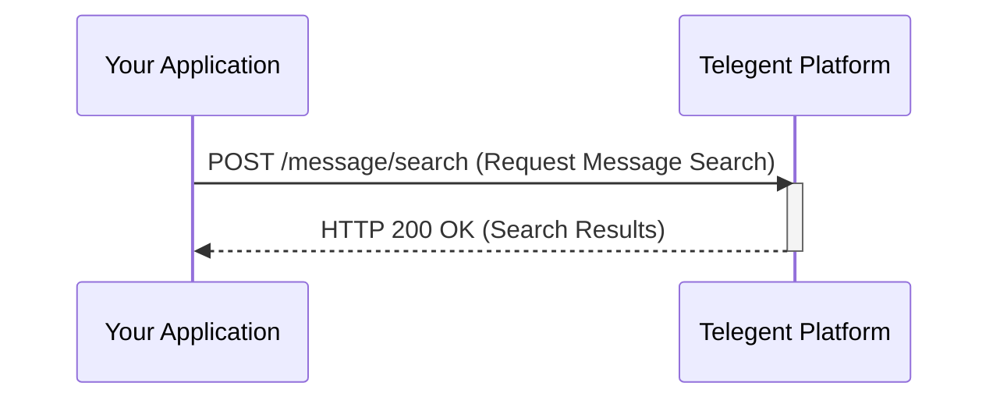

## Message Search

This endpoint allows you to search for messages based on various criteria.

### Endpoint

`/message/search`

**Method:** `POST`

### Request Body

| Parameter     | Type     | Description                                     | Required |
|---------------|----------|-------------------------------------------------|----------|
| `From`        | string   | Filter by the originating phone number.         | No       |
| `To`          | string   | Filter by the destination phone number.         | No       |
| `Direction`   | string   | Filter by message direction (`inbound` or `outbound`). | No       |
| `Status`      | string   | Filter by message status (e.g., `sent`, `delivered`, `failed`). | No       |
| `StartTime`   | string   | Filter by messages sent after this timestamp (ISO 8601). | No       |
| `EndTime`     | string   | Filter by messages sent before this timestamp (ISO 8601). | No       |
| `PageSize`    | integer  | The number of records to return per page. Defaults to 50. | No       |
| `PageToken`   | string   | A token to retrieve the next page of results.     | No       |

```json
{
  "Status": "failed",
  "StartTime": "2024-01-01T00:00:00Z",
  "EndTime": "2024-01-31T23:59:59Z",
  "Direction": "outbound",
  "PageSize": 100
}
```

### Response Body (200 OK)

The response will include a list of message objects matching the search criteria and pagination information.

```json
{
  "Messages": [
    {
      "MessageId": "MSG-failure1",
      "From": "+15551112222",
      "To": "+15553334444",
      "Direction": "outbound",
      "Status": "failed",
      "Timestamp": "2024-01-15T11:00:00Z",
      "ErrorCode": "50011",
      "ErrorMessage": "SMS geo permission denied"
    }
    // ... other matching messages
  ],
  "NextPageToken": "string",
  "PageSize": 100
}
```

### Response Properties

| Property       | Type     | Description                                   |
|----------------|----------|-----------------------------------------------|
| `Messages`     | array    | A list of message objects.                    |
| `MessageId`    | string   | Unique identifier for the message.            |
| `From`         | string   | The originating phone number.                 |
| `To`           | string   | The destination phone number.                 |
| `Direction`    | string   | The direction of the message (`inbound` or `outbound`). |
| `Status`       | string   | The current status of the message.            |
| `Timestamp`    | string   | Timestamp when the message was sent/received. |
| `ErrorCode`    | string   | Error code if the message failed.             |
| `ErrorMessage` | string   | Error message if the message failed.          |
| `NextPageToken`| string   | Token to retrieve the next page of results, or null if no more pages. |
| `PageSize`     | integer  | The number of results per page.               |

### Python Example

```python
import requests

url = "https://api.telegent.com/message/search"

headers = {
    "Authorization": "Bearer YOUR_ACCESS_TOKEN",
    "Content-Type": "application/json"
}

payload = {
    "Status": "failed",
    "StartTime": "2024-01-01T00:00:00Z",
    "EndTime": "2024-01-31T23:59:59Z"
}

try:
    response = requests.post(url, headers=headers, json=payload)
    response.raise_for_status() # Raise an exception for bad status codes

    search_results = response.json()
    print("Message Search Results:")
    for message in search_results.get('Messages', []):
        print(f"- Message ID: {message.get('MessageId')}, Status: {message.get('Status')}, Error: {message.get('ErrorMessage')}")

except requests.exceptions.RequestException as e:
    print(f"Error searching for messages: {e}")
    if response is not None:
        print(f"Response Body: {response.text}")
```

### Message Search Flow

