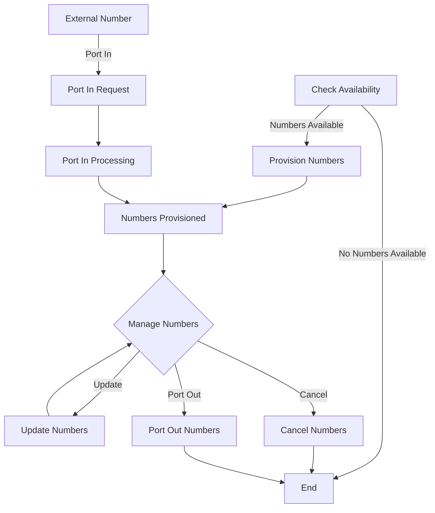

# Intelligent Mobile Numbers

The Intelligent Mobile Numbers API allows you to manage phone numbers for your Telegent account. With these endpoints, you can provision, update, search, port, and cancel mobile numbers for SMS, Voice, and Data services.

## Available Endpoints

<div className="grid grid-cols-1 gap-4 mt-6">
  <div className="border border-accent/20 rounded-lg overflow-hidden">
    <div className="bg-accent/5 px-4 py-2 border-b border-accent/20">
      <h3 className="text-base font-medium">Number Management</h3>
    </div>
    <div className="p-4 grid grid-cols-1 md:grid-cols-2 gap-4">
      <div>
        <div className="flex items-center gap-2">
          <span className="bg-green-500 text-white px-2 py-0.5 rounded-md text-xs font-semibold">GET</span>
          <span className="font-mono text-sm">/v1.0/numbers</span>
        </div>
        <p className="text-sm mt-1 text-slate-600 dark:text-slate-400">Retrieve details for a specific phone number</p>
        <a href="/api-reference/intelligent-mobile-numbers/number-details" className="text-xs font-medium text-primary mt-2 inline-block hover:underline">View Documentation →</a>
      </div>
      
      <div>
        <div className="flex items-center gap-2">
          <span className="bg-green-500 text-white px-2 py-0.5 rounded-md text-xs font-semibold">GET</span>
          <span className="font-mono text-sm">/v1.0/numbers/inventory</span>
        </div>
        <p className="text-sm mt-1 text-slate-600 dark:text-slate-400">Get your inventory of phone numbers</p>
        <a href="/api-reference/intelligent-mobile-numbers/number-inventory" className="text-xs font-medium text-primary mt-2 inline-block hover:underline">View Documentation →</a>
      </div>
      
      <div>
        <div className="flex items-center gap-2">
          <span className="bg-blue-500 text-white px-2 py-0.5 rounded-md text-xs font-semibold">POST</span>
          <span className="font-mono text-sm">/v1.0/numbers/availability</span>
        </div>
        <p className="text-sm mt-1 text-slate-600 dark:text-slate-400">Check availability of phone numbers</p>
        <a href="/api-reference/intelligent-mobile-numbers/available-numbers" className="text-xs font-medium text-primary mt-2 inline-block hover:underline">View Documentation →</a>
      </div>
      
      <div>
        <div className="flex items-center gap-2">
          <span className="bg-green-500 text-white px-2 py-0.5 rounded-md text-xs font-semibold">GET</span>
          <span className="font-mono text-sm">/v1.0/numbers/order</span>
        </div>
        <p className="text-sm mt-1 text-slate-600 dark:text-slate-400">Get details for a specific order</p>
        <a href="/api-reference/intelligent-mobile-numbers/order-details" className="text-xs font-medium text-primary mt-2 inline-block hover:underline">View Documentation →</a>
      </div>
    </div>
  </div>
  
  <div className="border border-accent/20 rounded-lg overflow-hidden">
    <div className="bg-accent/5 px-4 py-2 border-b border-accent/20">
      <h3 className="text-base font-medium">Number Provisioning & Updates</h3>
    </div>
    <div className="p-4 grid grid-cols-1 md:grid-cols-2 gap-4">
      <div>
        <div className="flex items-center gap-2">
          <span className="bg-blue-500 text-white px-2 py-0.5 rounded-md text-xs font-semibold">POST</span>
          <span className="font-mono text-sm">/v1.0/numbers/provision</span>
        </div>
        <p className="text-sm mt-1 text-slate-600 dark:text-slate-400">Provision new phone numbers</p>
        <a href="/api-reference/intelligent-mobile-numbers/number-provision" className="text-xs font-medium text-primary mt-2 inline-block hover:underline">View Documentation →</a>
      </div>
      
      <div>
        <div className="flex items-center gap-2">
          <span className="bg-blue-500 text-white px-2 py-0.5 rounded-md text-xs font-semibold">POST</span>
          <span className="font-mono text-sm">/v1.0/numbers/update</span>
        </div>
        <p className="text-sm mt-1 text-slate-600 dark:text-slate-400">Update existing phone numbers</p>
        <a href="/api-reference/intelligent-mobile-numbers/numbers-update" className="text-xs font-medium text-primary mt-2 inline-block hover:underline">View Documentation →</a>
      </div>
      
      <div>
        <div className="flex items-center gap-2">
          <span className="bg-blue-500 text-white px-2 py-0.5 rounded-md text-xs font-semibold">POST</span>
          <span className="font-mono text-sm">/v1.0/numbers/cancel</span>
        </div>
        <p className="text-sm mt-1 text-slate-600 dark:text-slate-400">Cancel phone numbers</p>
        <a href="/api-reference/intelligent-mobile-numbers/numbers-cancel" className="text-xs font-medium text-primary mt-2 inline-block hover:underline">View Documentation →</a>
      </div>
    </div>
  </div>
  
  <div className="border border-accent/20 rounded-lg overflow-hidden">
    <div className="bg-accent/5 px-4 py-2 border-b border-accent/20">
      <h3 className="text-base font-medium">Number Porting</h3>
    </div>
    <div className="p-4 grid grid-cols-1 md:grid-cols-2 gap-4">
      <div>
        <div className="flex items-center gap-2">
          <span className="bg-blue-500 text-white px-2 py-0.5 rounded-md text-xs font-semibold">POST</span>
          <span className="font-mono text-sm">/v1.0/numbers/portin</span>
        </div>
        <p className="text-sm mt-1 text-slate-600 dark:text-slate-400">Port a number into Telegent</p>
        <a href="/api-reference/intelligent-mobile-numbers/port-in" className="text-xs font-medium text-primary mt-2 inline-block hover:underline">View Documentation →</a>
      </div>
      
      <div>
        <div className="flex items-center gap-2">
          <span className="bg-blue-500 text-white px-2 py-0.5 rounded-md text-xs font-semibold">POST</span>
          <span className="font-mono text-sm">/v1.0/numbers/portout</span>
        </div>
        <p className="text-sm mt-1 text-slate-600 dark:text-slate-400">Port a number out of Telegent</p>
        <a href="/api-reference/intelligent-mobile-numbers/port-out" className="text-xs font-medium text-primary mt-2 inline-block hover:underline">View Documentation →</a>
      </div>
    </div>
  </div>
</div>

## Number Lifecycle

The following diagram illustrates the lifecycle of a phone number in the Telegent system:

<div className="my-6">

</div>

## Response Format

All responses from the Intelligent Mobile Numbers API use PascalCase property names. Here's an example response:

```json
{
  "NumberType": "p2p",
  "PhoneNumber": "18015555555",
  "ProductId": "MVNO",
  "SmsEnabled": "Yes",
  "SmsUrl": "https://endpoint.com",
  "SmsUrlMethod": "POST",
  "VoiceEnabled": "Yes",
  "VoiceRouteId": "T9992774"
}
```

## Authentication

All Intelligent Mobile Numbers API endpoints require authentication. Include your Pop-Token in the request headers:

```
Pop-Token: YOUR_TOKEN_HERE
```

See the [Authentication](/api-reference/authentication) section for details on obtaining an access token. 