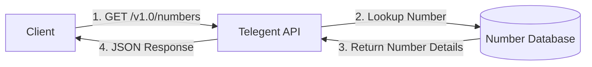

# Number Details

<div className="mt-4 border border-accent/20 rounded-md overflow-hidden">
  <div className="bg-accent/5 px-4 py-2 border-b border-accent/20 flex justify-between items-center">
    <div className="flex items-center gap-2">
      <span className="bg-green-500 text-white px-2 py-0.5 rounded-md text-xs font-semibold">GET</span>
      <span className="font-mono text-sm">/v1.0/numbers</span>
    </div>
    <span className="text-xs font-medium text-slate-500">Number Details</span>
  </div>
  
  <div className="p-4">
    <p className="text-sm mb-4">
      This endpoint retrieves details about a specific phone number in your account.
    </p>
    
    <div className="mb-6">
      <h4 className="text-sm font-semibold mb-2">Request Parameters</h4>
      <table className="min-w-full text-sm">
        <thead>
          <tr className="border-b border-accent/20">
            <th className="text-left py-2 font-semibold">Parameter</th>
            <th className="text-left py-2 font-semibold">Type</th>
            <th className="text-left py-2 font-semibold">Description</th>
            <th className="text-left py-2 font-semibold">Required</th>
          </tr>
        </thead>
        <tbody>
          <tr className="border-b border-accent/10">
            <td className="py-2 font-mono">PhoneNumber</td>
            <td className="py-2">String</td>
            <td className="py-2">The phone number to retrieve details for</td>
            <td className="py-2">Yes</td>
          </tr>
        </tbody>
      </table>
    </div>
    
    <div className="mb-6">
      <h4 className="text-sm font-semibold mb-2">Response</h4>
      <p className="text-sm mb-2">
        A successful request returns a JSON object containing the details of the requested phone number.
      </p>
      <div className="bg-slate-50 dark:bg-slate-800/50 rounded-md p-3 overflow-x-auto">
```json
{
  "NumberType": "p2p",
  "PhoneNumber": "18015555555",
  "ProductId": "MVNO",
  "SmsEnabled": "Yes",
  "SmsUrl": "https://endpoint.com",
  "SmsUrlMethod": "POST",
  "VoiceEnabled": "Yes",
  "VoiceRouteId": "T9992774"
}
```
      </div>
    </div>
    
    <div className="mb-6">
      <h4 className="text-sm font-semibold mb-2">Response Properties</h4>
      <table className="min-w-full text-sm">
        <thead>
          <tr className="border-b border-accent/20">
            <th className="text-left py-2 font-semibold">Property</th>
            <th className="text-left py-2 font-semibold">Type</th>
            <th className="text-left py-2 font-semibold">Description</th>
          </tr>
        </thead>
        <tbody>
          <tr className="border-b border-accent/10">
            <td className="py-2 font-mono">NumberType</td>
            <td className="py-2">String</td>
            <td className="py-2">The type of phone number (e.g., "p2p")</td>
          </tr>
          <tr className="border-b border-accent/10">
            <td className="py-2 font-mono">PhoneNumber</td>
            <td className="py-2">String</td>
            <td className="py-2">The phone number</td>
          </tr>
          <tr className="border-b border-accent/10">
            <td className="py-2 font-mono">ProductId</td>
            <td className="py-2">String</td>
            <td className="py-2">The product ID associated with the number</td>
          </tr>
          <tr className="border-b border-accent/10">
            <td className="py-2 font-mono">SmsEnabled</td>
            <td className="py-2">String</td>
            <td className="py-2">Whether SMS is enabled for the number ("Yes" or "No")</td>
          </tr>
          <tr className="border-b border-accent/10">
            <td className="py-2 font-mono">SmsUrl</td>
            <td className="py-2">String</td>
            <td className="py-2">The URL for SMS</td>
          </tr>
          <tr className="border-b border-accent/10">
            <td className="py-2 font-mono">SmsUrlMethod</td>
            <td className="py-2">String</td>
            <td className="py-2">The HTTP method for the SMS URL</td>
          </tr>
          <tr className="border-b border-accent/10">
            <td className="py-2 font-mono">VoiceEnabled</td>
            <td className="py-2">String</td>
            <td className="py-2">Whether voice is enabled for the number ("Yes" or "No")</td>
          </tr>
          <tr className="border-b border-accent/10">
            <td className="py-2 font-mono">VoiceRouteId</td>
            <td className="py-2">String</td>
            <td className="py-2">The ID of the voice route associated with the number</td>
          </tr>
        </tbody>
      </table>
    </div>
    
    <div className="mb-6">
      <h4 className="text-sm font-semibold mb-2">Python Example</h4>
      <div className="bg-slate-50 dark:bg-slate-800/50 rounded-md p-3 overflow-x-auto">
```python
import requests

url = "https://api.telegent.com/v1.0/numbers"

params = {
  "PhoneNumber": "18015555555"
}

headers = {
  "Pop-Token": "YOUR_TOKEN_HERE"
}

response = requests.get(url, headers=headers, params=params)
data = response.json()

print(data)
```
      </div>
    </div>
    
    <div className="rounded-md bg-amber-50 dark:bg-amber-900/20 border border-amber-200 dark:border-amber-700 p-4">
      <div className="flex">
        <div className="flex-shrink-0">
          <svg className="h-5 w-5 text-amber-400" viewBox="0 0 20 20" fill="currentColor">
            <path fillRule="evenodd" d="M8.257 3.099c.765-1.36 2.722-1.36 3.486 0l5.58 9.92c.75 1.334-.213 2.98-1.742 2.98H4.42c-1.53 0-2.493-1.646-1.743-2.98l5.58-9.92zM11 13a1 1 0 11-2 0 1 1 0 012 0zm-1-8a1 1 0 00-1 1v3a1 1 0 002 0V6a1 1 0 00-1-1z" clipRule="evenodd" />
          </svg>
        </div>
        <div className="ml-3">
          <h3 className="text-sm font-medium text-amber-800 dark:text-amber-200">Note on PascalCase</h3>
          <div className="mt-2 text-sm text-amber-700 dark:text-amber-300">
            <p>
              All request and response parameters for this API use PascalCase naming convention (e.g., "PhoneNumber" not "phoneNumber").
            </p>
          </div>
        </div>
      </div>
    </div>
  </div>
</div>

## Data Flow

The following diagram shows how the Number Details API interacts with other components of the Telegent system:

<div className="my-6">

</div>

## Related Endpoints

- [Number Inventory](/api-reference/intelligent-mobile-numbers/number-inventory) - List all phone numbers in your inventory
- [Number Provision](/api-reference/intelligent-mobile-numbers/number-provision) - Provision new phone numbers
- [Numbers Update](/api-reference/intelligent-mobile-numbers/numbers-update) - Update phone number settings 