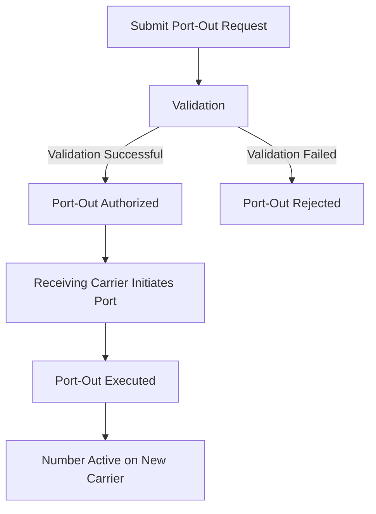

# Port Out

<div className="mt-4 border border-accent/20 rounded-md overflow-hidden">
  <div className="bg-accent/5 px-4 py-2 border-b border-accent/20 flex justify-between items-center">
    <div className="flex items-center gap-2">
      <span className="bg-blue-500 text-white px-2 py-0.5 rounded-md text-xs font-semibold">POST</span>
      <span className="font-mono text-sm">/v1.0/numbers/portout</span>
    </div>
    <span className="text-xs font-medium text-slate-500">Port Out a Phone Number</span>
  </div>
  
  <div className="p-4">
    <p className="text-sm mb-4">
      This endpoint allows you to initiate a port-out request for a phone number from Telegent to another carrier.
    </p>
    
    <div className="mb-6">
      <h4 className="text-sm font-semibold mb-2">Request Body</h4>
      <div className="bg-slate-50 dark:bg-slate-800/50 rounded-md p-3 overflow-x-auto">
```json
{
  "PortOutMsisdn": "17746996223",
  "Name": "Joonto",
  "OspAccountPassword": "1234"
}
```
      </div>
    </div>
    
    <div className="mb-6">
      <h4 className="text-sm font-semibold mb-2">Request Parameters</h4>
      <table className="min-w-full text-sm">
        <thead>
          <tr className="border-b border-accent/20">
            <th className="text-left py-2 font-semibold">Parameter</th>
            <th className="text-left py-2 font-semibold">Type</th>
            <th className="text-left py-2 font-semibold">Description</th>
            <th className="text-left py-2 font-semibold">Required</th>
          </tr>
        </thead>
        <tbody>
          <tr className="border-b border-accent/10">
            <td className="py-2 font-mono">PortOutMsisdn</td>
            <td className="py-2">String</td>
            <td className="py-2">The phone number to be ported out</td>
            <td className="py-2">Yes</td>
          </tr>
          <tr className="border-b border-accent/10">
            <td className="py-2 font-mono">Name</td>
            <td className="py-2">String</td>
            <td className="py-2">The name associated with the port-out request</td>
            <td className="py-2">Yes</td>
          </tr>
          <tr className="border-b border-accent/10">
            <td className="py-2 font-mono">OspAccountPassword</td>
            <td className="py-2">String</td>
            <td className="py-2">The password for the OSP account</td>
            <td className="py-2">Yes</td>
          </tr>
        </tbody>
      </table>
    </div>
    
    <div className="mb-6">
      <h4 className="text-sm font-semibold mb-2">Response</h4>
      <p className="text-sm mb-2">
        A successful request returns a JSON object containing the status of the port-out request and related information.
      </p>
      <div className="bg-slate-50 dark:bg-slate-800/50 rounded-md p-3 overflow-x-auto">
```json
{
  "Status": "Port Out Pending",
  "Iccid": "8901240397190013079",
  "PortOut": {
    "PortOutMsisdn": "17746996223",
    "Name": "Joonto",
    "OspAccountPassword": "1234"
  }
}
```
      </div>
    </div>
    
    <div className="mb-6">
      <h4 className="text-sm font-semibold mb-2">Response Properties</h4>
      <table className="min-w-full text-sm">
        <thead>
          <tr className="border-b border-accent/20">
            <th className="text-left py-2 font-semibold">Property</th>
            <th className="text-left py-2 font-semibold">Type</th>
            <th className="text-left py-2 font-semibold">Description</th>
          </tr>
        </thead>
        <tbody>
          <tr className="border-b border-accent/10">
            <td className="py-2 font-mono">Status</td>
            <td className="py-2">String</td>
            <td className="py-2">The status of the port-out request</td>
          </tr>
          <tr className="border-b border-accent/10">
            <td className="py-2 font-mono">Iccid</td>
            <td className="py-2">String</td>
            <td className="py-2">The ICCID associated with the port-out request</td>
          </tr>
          <tr className="border-b border-accent/10">
            <td className="py-2 font-mono">PortOut</td>
            <td className="py-2">Object</td>
            <td className="py-2">An object containing the port-out request details</td>
          </tr>
        </tbody>
      </table>
    </div>
    
    <div className="mb-6">
      <h4 className="text-sm font-semibold mb-2">Python Example</h4>
      <div className="bg-slate-50 dark:bg-slate-800/50 rounded-md p-3 overflow-x-auto">
```python
import requests
import json

url = "https://api.telegent.com/v1.0/numbers/portout"

payload = json.dumps({
  "PortOutMsisdn": "17746996223",
  "Name": "Joonto",
  "OspAccountPassword": "1234"
})

headers = {
  "Content-Type": "application/json",
  "Pop-Token": "YOUR_TOKEN_HERE"
}

response = requests.post(url, headers=headers, data=payload)
data = response.json()

print(data)
```
      </div>
    </div>
    
    <div className="rounded-md bg-amber-50 dark:bg-amber-900/20 border border-amber-200 dark:border-amber-700 p-4">
      <div className="flex">
        <div className="flex-shrink-0">
          <svg className="h-5 w-5 text-amber-400" viewBox="0 0 20 20" fill="currentColor">
            <path fillRule="evenodd" d="M8.257 3.099c.765-1.36 2.722-1.36 3.486 0l5.58 9.92c.75 1.334-.213 2.98-1.742 2.98H4.42c-1.53 0-2.493-1.646-1.743-2.98l5.58-9.92zM11 13a1 1 0 11-2 0 1 1 0 012 0zm-1-8a1 1 0 00-1 1v3a1 1 0 002 0V6a1 1 0 00-1-1z" clipRule="evenodd" />
          </svg>
        </div>
        <div className="ml-3">
          <h3 className="text-sm font-medium text-amber-800 dark:text-amber-200">Important</h3>
          <div className="mt-2 text-sm text-amber-700 dark:text-amber-300">
            <p>
              Port-out requests are processed when the receiving carrier submits a port request. The phone number will remain active with Telegent until the port is complete.
            </p>
          </div>
        </div>
      </div>
    </div>
  </div>
</div>

## Port-Out Process

Porting a number from Telegent to another carrier involves several steps:

<div className="my-6">

</div>

## Port-Out Requirements

To successfully port a number from Telegent to another carrier:

1. **Account Info**: Provide accurate account information to the receiving carrier
2. **Active Status**: The number must be active and in good standing with Telegent
3. **No Outstanding Balance**: There should be no outstanding balance on your Telegent account
4. **Authorization**: You must be authorized to port the number

## Port-Out Status

The port-out request may have the following statuses:

- **Port Out Pending**: Telegent has received and validated the port-out request
- **Port Out Processing**: The port-out request is being processed by the receiving carrier
- **Port Out Complete**: The port-out has been completed, and the number is now active with the new carrier
- **Port Out Rejected**: The port-out request has been rejected

## Related Endpoints

- [Number Inventory](/api-reference/intelligent-mobile-numbers/number-inventory) - View your number inventory
- [Port In](/api-reference/intelligent-mobile-numbers/port-in) - Port a number into Telegent
- [Number Details](/api-reference/intelligent-mobile-numbers/number-details) - View number details 