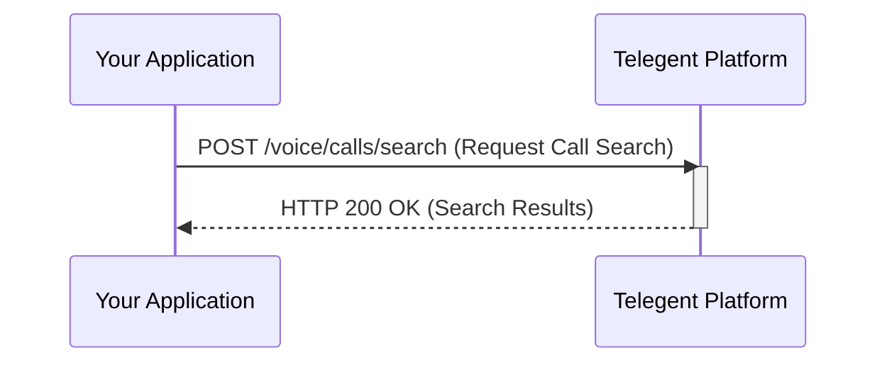

## Call Search

This endpoint allows you to search for voice calls based on various criteria.

### Endpoint

`/voice/calls/search`

**Method:** `POST`

### Request Body

| Parameter   | Type    | Description                                     | Required |
|-------------|---------|-------------------------------------------------|----------|
| `From`      | string  | Filter by the originating phone number.         | No       |
| `To`        | string  | Filter by the destination phone number.         | No       |
| `Direction` | string  | Filter by call direction (`inbound` or `outbound`). | No       |
| `Status`    | string  | Filter by call status (e.g., `completed`, `failed`). | No       |
| `StartTime` | string  | Filter by calls starting after this timestamp (ISO 8601). | No       |
| `EndTime`   | string  | Filter by calls ending before this timestamp (ISO 8601). | No       |
| `ClientState` | string  | Filter by custom data associated with the call. | No       |
| `PageSize`  | integer | The number of records to return per page. Defaults to 50. | No       |
| `PageToken` | string  | A token to retrieve the next page of results.     | No       |

```json
{
  "Status": "failed",
  "StartTime": "2023-10-01T00:00:00Z",
  "EndTime": "2023-10-31T23:59:59Z",
  "PageSize": 100
}
```

### Response Body (200 OK)

The response will include a list of call objects matching the search criteria and pagination information.

```json
{
  "Calls": [
    {
      "CallId": "call_failure1",
      "From": "+15551112222",
      "To": "+15553334444",
      "Direction": "outbound",
      "Status": "failed",
      "StartTime": "2023-10-15T11:00:00Z",
      "EndTime": "2023-10-15T11:00:10Z",
      "Duration": 10,
      "ErrorCode": "12001",
      "ErrorMessage": "Dial Failed",
      "ClientState": "campaign_xyz"
    }
    // ... other matching calls
  ],
  "NextPageToken": "string",
  "PageSize": 100
}
```

### Response Properties

| Property        | Type    | Description                                  |
|-----------------|---------|----------------------------------------------|
| `Calls`         | array   | A list of call objects.                      |
| `CallId`        | string  | Unique identifier for the call.              |
| `From`          | string  | The originating phone number.                |
| `To`            | string  | The destination phone number.                |
| `Direction`     | string  | The direction of the call (`inbound` or `outbound`). |
| `Status`        | string  | The current status of the call.              |
| `StartTime`     | string  | Timestamp when the call started.             |
| `EndTime`       | string  | Timestamp when the call ended (if applicable). |
| `Duration`      | integer | Duration of the call in seconds (if applicable). |
| `ErrorCode`     | string  | Error code if the call failed.               |
| `ErrorMessage`  | string  | Error message if the call failed.            |
| `ClientState`   | string  | Custom data associated with the call.        |
| `NextPageToken` | string  | Token to retrieve the next page of results, or null if no more pages. |
| `PageSize`      | integer | The number of results per page.              |

### Python Example

```python
import requests

url = "https://api.telegent.com/voice/calls/search"

headers = {
    "Authorization": "Bearer YOUR_ACCESS_TOKEN",
    "Content-Type": "application/json"
}

payload = {
    "Status": "failed",
    "StartTime": "2023-10-01T00:00:00Z",
    "EndTime": "2023-10-31T23:59:59Z",
    "PageSize": 100
}

try:
    response = requests.post(url, headers=headers, json=payload)
    response.raise_for_status() # Raise an exception for bad status codes

    search_results = response.json()
    print("Call Search Results:")
    for call in search_results.get('Calls', []):
        print(f"- Call ID: {call.get('CallId')}, Status: {call.get('Status')}, Error: {call.get('ErrorMessage')}")

except requests.exceptions.RequestException as e:
    print(f"Error searching for calls: {e}")
    if response is not None:
        print(f"Response Body: {response.text}")
```

### Call Search Flow

