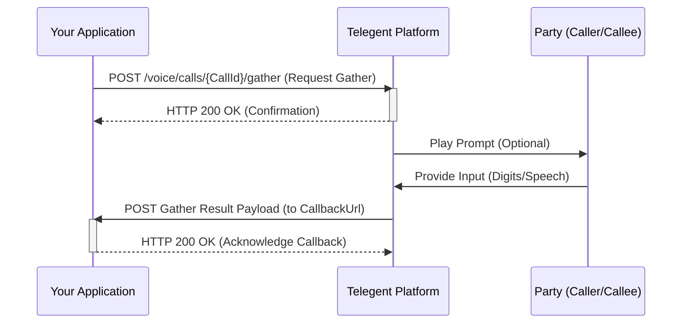

## Gather Input

This endpoint allows you to collect digits pressed on the dialpad (DTMF) or speech input from one party in an ongoing call.

### Endpoint

`/voice/calls/{CallId}/gather`

**Method:** `POST`

### Path Parameters

| Parameter | Type   | Description                         | Required |
|-----------|--------|-------------------------------------|----------|
| `CallId`  | string | The unique identifier of the call. | Yes      |

### Request Body

| Parameter         | Type    | Description                                                                 | Required |
|-------------------|---------|-----------------------------------------------------------------------------|----------|
| `InputType`       | string  | The type of input to gather (`dtmf`, `speech`, or `dtmf speech`).          | Yes      |
| `Timeout`         | integer | The number of seconds to wait for input. Defaults to 5.                     | No       |
| `NumDigits`       | integer | The maximum number of digits to collect if `InputType` is `dtmf`.           | No       |
| `SpeechModel`     | string  | The speech recognition model to use if `InputType` includes `speech`.       | No       |
| `EndGatherOnKey`  | string  | A digit to terminate DTMF gathering. Defaults to `#`.                      | No       |
| `Prompt`          | object  | An object containing instructions for the prompt (e.g., `{'Text': 'Press 1 or say sales.'}`). | No       |
| `CallbackUrl`     | string  | URL to receive the gathered input result.                                   | No       |
| `ClientState`     | string  | Custom data to be included in the callback event.                           | No       |

```json
{
  "InputType": "dtmf",
  "NumDigits": 1,
  "Timeout": 10,
  "Prompt": {
    "Text": "Press one for sales, or two for support.",
    "Voice": "male"
  },
  "CallbackUrl": "https://your-app.com/gather-callback",
  "ClientState": "mainmenu"
}
```

### Response Body (200 OK)

A successful request will typically return a `200 OK` response confirming that the gather action has been initiated.

```json
{
  "Message": "Gather action initiated successfully",
  "CallId": "call_12345abcde"
}
```

### Callback Event (POST to CallbackUrl)

When input is gathered or the timeout is reached, Telegent will send a `POST` request to the `CallbackUrl` with the result:

| Parameter     | Type   | Description                                  |
|---------------|--------|----------------------------------------------|
| `CallId`      | string | Unique identifier for the call.              |
| `Status`      | string | Status of the gather (`completed` or `timeout`). |
| `Digits`      | string | The collected digits (if `InputType` was `dtmf` and `Status` is `completed`). | No       |
| `SpeechResult`| string | The recognized speech (if `InputType` included `speech` and `Status` is `completed`). | No       |
| `ClientState` | string | Custom data provided in the initial request. | No       |

```json
{
  "CallId": "call_12345abcde",
  "Status": "completed",
  "Digits": "1",
  "ClientState": "mainmenu"
}
```

### Python Example (Initiating Gather)

```python
import requests

call_id = "call_12345abcde"
url = f"https://api.telegent.com/voice/calls/{call_id}/gather"

headers = {
    "Authorization": "Bearer YOUR_ACCESS_TOKEN",
    "Content-Type": "application/json"
}

payload = {
  "InputType": "dtmf",
  "NumDigits": 1,
  "Timeout": 15,
  "Prompt": {
    "Text": "Please enter your 5 digit extension.",
    "Voice": "alice"
  },
  "CallbackUrl": "https://your-app.com/gather-callback",
  "ClientState": "extension_input"
}

try:
    response = requests.post(url, headers=headers, json=payload)
    response.raise_for_status() # Raise an exception for bad status codes

    gather_status = response.json()
    print("Gather Action Status:")
    print(f"Call Id: {gather_status.get('CallId')}")
    print(f"Message: {gather_status.get('Message')}")

except requests.exceptions.RequestException as e:
    print(f"Error initiating gather action: {e}")
    if response is not None:
        print(f"Response Body: {response.text}")
```

### Gather Input Flow

