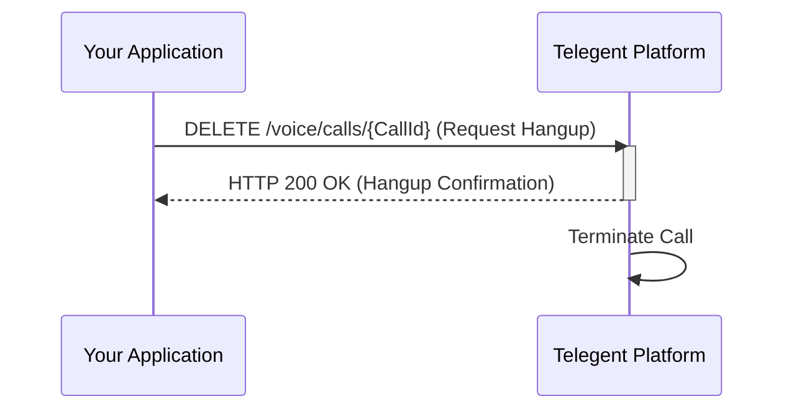

## Hangup Call

This endpoint allows you to programmatically end an ongoing voice call.

### Endpoint

`/voice/calls/{CallId}`

**Method:** `DELETE`

### Path Parameters

| Parameter | Type   | Description                       | Required |
|-----------|--------|-----------------------------------|----------|
| `CallId`  | string | The unique identifier of the call to hang up. | Yes      |

### Response Body (200 OK)

A successful hangup request will typically return a `200 OK` response with a confirmation.

```json
{
  "Message": "Call hung up successfully",
  "CallId": "call_12345abcde"
}
```

### Python Example

```python
import requests

call_id = "call_12345abcde"
url = f"https://api.telegent.com/voice/calls/{call_id}"

headers = {
    "Authorization": "Bearer YOUR_ACCESS_TOKEN"
}

try:
    response = requests.delete(url, headers=headers)
    response.raise_for_status() # Raise an exception for bad status codes

    hangup_status = response.json()
    print("Hangup Status:")
    print(f"Call ID: {hangup_status.get('CallId')}")
    print(f"Message: {hangup_status.get('Message')}")

except requests.exceptions.RequestException as e:
    print(f"Error hanging up call: {e}")
    if response is not None:
        print(f"Response Body: {response.text}")
```

### Hangup Call Flow

