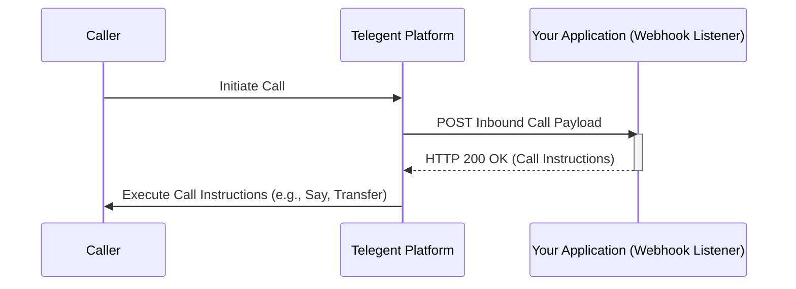

## Inbound Call

This section describes how to receive and handle inbound voice calls via webhooks.

### Endpoint

Inbound calls are received by your application via a configured webhook URL. Telegent will send a `POST` request to this URL when an inbound call is received.

**Method:** `POST`

### Request Body

The payload for an inbound call webhook will typically include:

| Parameter    | Type   | Description                                  |
|--------------|--------|----------------------------------------------|
| `CallId`     | string | Unique identifier for the incoming call.     |
| `From`       | string | The caller's phone number.                   |
| `To`         | string | Your Telegent phone number that received the call. |
| `Direction`  | string | Indicates the call direction (e.g., `inbound`). |
| `Timestamp`  | string | Timestamp when the call was received.        |
| `ClientState`| string | Custom data if associated with the number.   | 

```json
{
  "CallId": "call_abcdef12345",
  "From": "+15559876543",
  "To": "+15551234567",
  "Direction": "inbound",
  "Timestamp": "2023-10-27T10:05:00Z",
  "ClientState": "branch42"
}
```

### Responding to an Inbound Call

Your application's response to the inbound call webhook tells Telegent how to handle the call. The response body should be a JSON object containing instructions for the call leg. Common instructions include:

*   **`<Say>`:** Speak text to the caller.
*   **` collectDigits`:** Collect digits pressed by the caller.
*   **` transferCall`:** Transfer the call to another number or endpoint.
*   **` playAudio`:** Play an audio file.

```json
{
  "Response": [
    {
      "Instruction": "say",
      "Text": "Thank you for calling Telegent. Please wait while we connect you.",
      "Voice": "female"
    },
    {
      "Instruction": "transferCall",
      "To": "+15552223333"
    }
  ]
}
```

### Python Example (Webhook Listener - Flask)

```python
from flask import Flask, request, json

app = Flask(__name__)

@app.route('/voice-webhook', methods=['POST'])
def handle_inbound_call():
    """
    Handles incoming inbound calls from the Telegent platform webhook.
    """
    try:
        call_payload = request.json
        print("Received Inbound Call:")
        print(json.dumps(call_payload, indent=2))

        # Example: Play a message and then transfer the call
        response_payload = {
            "Response": [
                {
                    "Instruction": "say",
                    "Text": "Welcome to our service. Please wait to be connected.",
                    "Voice": "alice"
                },
                {
                    "Instruction": "transferCall",
                    "To": "+15558887777"
                }
            ]
        }

        # Respond with instructions for the call
        return json.jsonify(response_payload), 200

    except Exception as e:
        print(f"Error processing inbound call: {e}")
        # Return an error status if processing failed
        return "Internal Server Error", 500

if __name__ == '__main__':
    # Remember to use a production-ready WSGI server in production
    # Also, your application needs to be publicly accessible for the webhook to reach it
    app.run(port=5002, debug=True)
```

### Inbound Call Flow

