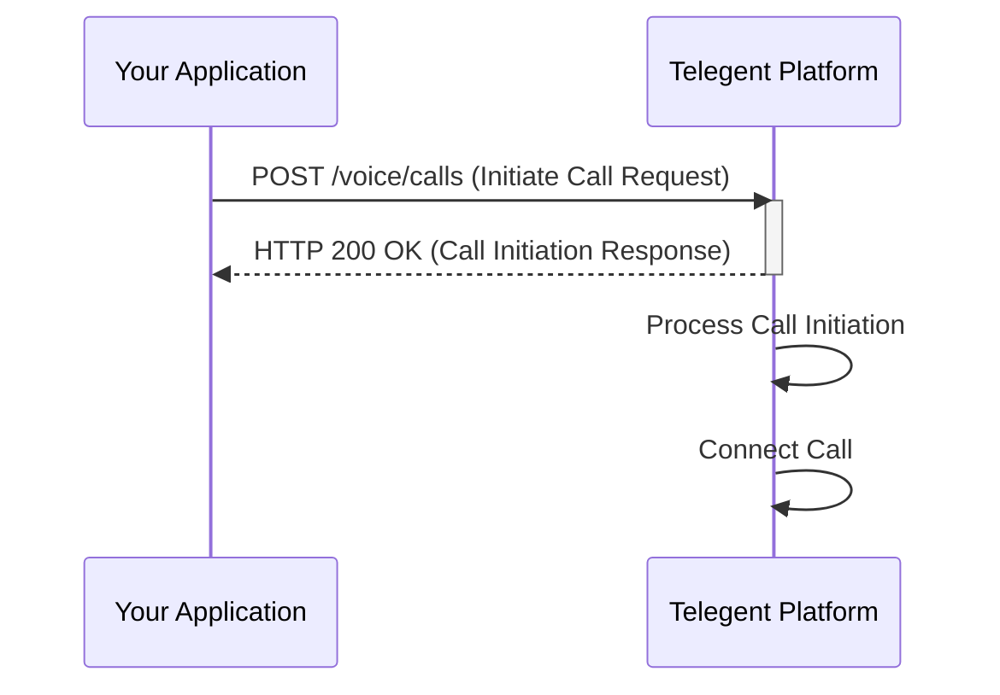

## Initiate Call

This endpoint allows you to programmatically initiate an outbound voice call.

### Endpoint

`/voice/calls`

**Method:** `POST`

### Request Body

| Parameter      | Type   | Description                                   | Required |
|----------------|--------|-----------------------------------------------|----------|
| `From`         | string | The originating phone number (your Telegent number). | Yes      |
| `To`           | string | The destination phone number to call.          | Yes      |
| `CallbackUrl`  | string | URL to receive call status updates and events. | No       |
| `ClientState`  | string | Custom data to be included in callback events.  | No       |

```json
{
  "From": "+15551234567",
  "To": "+15557654321",
  "CallbackUrl": "https://your-app.com/voice-callback",
  "ClientState": "user123"
}
```

### Response Body (200 OK)

| Parameter   | Type   | Description                     |
|-------------|--------|---------------------------------|
| `CallId`    | string | Unique identifier for the initiated call. |
| `Status`    | string | Initial status of the call (e.g., `initiated`). |
| `Timestamp` | string | Timestamp of the call initiation. |

```json
{
  "CallId": "call_12345abcde",
  "Status": "initiated",
  "Timestamp": "2023-10-27T10:00:00Z"
}
```

### Python Example

```python
import requests

url = "https://api.telegent.com/voice/calls"

headers = {
    "Authorization": "Bearer YOUR_ACCESS_TOKEN",
    "Content-Type": "application/json"
}

payload = {
    "From": "+15551234567",
    "To": "+15557654321",
    "CallbackUrl": "https://your-app.com/voice-callback",
    "ClientState": "user123"
}

try:
    response = requests.post(url, headers=headers, json=payload)
    response.raise_for_status() # Raise an exception for bad status codes

    call_details = response.json()
    print("Call initiated successfully:")
    print(f"Call ID: {call_details.get('CallId')}")
    print(f"Status: {call_details.get('Status')}")

except requests.exceptions.RequestException as e:
    print(f"Error initiating call: {e}")
    if response is not None:
        print(f"Response Body: {response.text}")
```

### Call Initiation Flow

