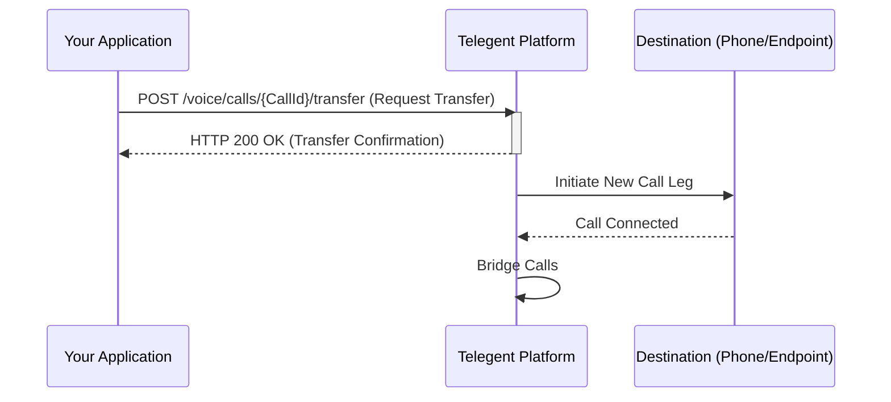

## Transfer Call

This endpoint allows you to transfer an ongoing voice call to another phone number or endpoint.

### Endpoint

`/voice/calls/{CallId}/transfer`

**Method:** `POST`

### Path Parameters

| Parameter | Type   | Description                         | Required |
|-----------|--------|-------------------------------------|----------|
| `CallId`  | string | The unique identifier of the call to transfer. | Yes      |

### Request Body

| Parameter | Type   | Description                                   | Required |
|-----------|--------|-----------------------------------------------|----------|
| `To`      | string | The destination phone number or endpoint to transfer the call to. | Yes      |

```json
{
  "To": "+15558889999"
}
```

### Response Body (200 OK)

A successful transfer request will typically return a `200 OK` response confirming the action.

```json
{
  "Message": "Call transfer initiated successfully",
  "CallId": "call_12345abcde",
  "Status": "transferring"
}
```

### Python Example

```python
import requests

call_id = "call_12345abcde"
url = f"https://api.telegent.com/voice/calls/{call_id}/transfer"

headers = {
    "Authorization": "Bearer YOUR_ACCESS_TOKEN",
    "Content-Type": "application/json"
}

payload = {
    "To": "+15558889999"
}

try:
    response = requests.post(url, headers=headers, json=payload)
    response.raise_for_status() # Raise an exception for bad status codes

    transfer_status = response.json()
    print("Transfer Status:")
    print(f"Call ID: {transfer_status.get('CallId')}")
    print(f"Message: {transfer_status.get('Message')}")
    print(f"Status: {transfer_status.get('Status')}")

except requests.exceptions.RequestException as e:
    print(f"Error initiating call transfer: {e}")
    if response is not None:
        print(f"Response Body: {response.text}")
```

### Call Transfer Flow

