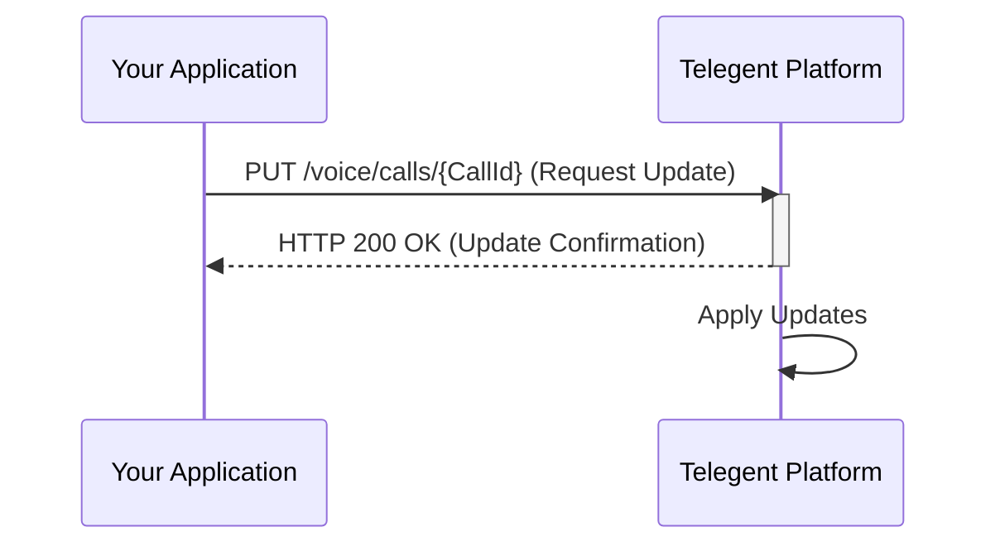

## Update Call

This endpoint allows you to update certain parameters of an ongoing voice call.

### Endpoint

`/voice/calls/{CallId}`

**Method:** `PUT`

### Path Parameters

| Parameter | Type   | Description                         | Required |
|-----------|--------|-------------------------------------|----------|
| `CallId`  | string | The unique identifier of the call to update. | Yes      |

### Request Body

| Parameter      | Type   | Description                                   | Required |
|----------------|--------|-----------------------------------------------|----------|
| `CallbackUrl`  | string | Update the URL to receive call status updates and events. | No       |
| `ClientState`  | string | Update the custom data associated with the call. | No       |
| `Status`       | string | Update the call status (e.g., to end the call gracefully). | No       |

```json
{
  "CallbackUrl": "https://your-app.com/new-voice-callback",
  "ClientState": "updated_user123"
}
```

OR to end the call:

```json
{
  "Status": "completed"
}
```

### Response Body (200 OK)

A successful update request will typically return a `200 OK` response confirming the update.

```json
{
  "Message": "Call updated successfully",
  "CallId": "call_12345abcde"
}
```

### Python Example

```python
import requests

call_id = "call_12345abcde"
url = f"https://api.telegent.com/voice/calls/{call_id}"

headers = {
    "Authorization": "Bearer YOUR_ACCESS_TOKEN",
    "Content-Type": "application/json"
}

payload = {
    "ClientState": "updated_session_data"
}

try:
    response = requests.put(url, headers=headers, json=payload)
    response.raise_for_status() # Raise an exception for bad status codes

    update_status = response.json()
    print("Update Call Status:")
    print(f"Call ID: {update_status.get('CallId')}")
    print(f"Message: {update_status.get('Message')}")

except requests.exceptions.RequestException as e:
    print(f"Error updating call: {e}")
    if response is not None:
        print(f"Response Body: {response.text}")
```

### Update Call Flow

