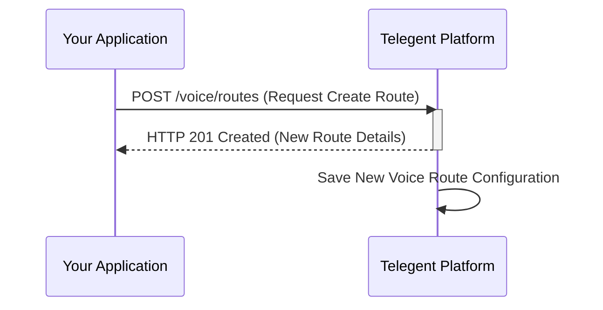

## Create Voice Route

This endpoint allows you to create a new voice route for your account.

### Endpoint

`/voice/routes`

**Method:** `POST`

### Request Body

| Parameter        | Type   | Description                                                              | Required |
|------------------|--------|--------------------------------------------------------------------------|----------|
| `RouteName`      | string | A descriptive name for the voice route.                                  | Yes      |
| `RouteType`      | string | The type of voice route (`Webhook` or `Transfer`).                       | Yes      |
| `InboundUrl`     | string | The URL for handling inbound calls (required if `RouteType` is `Webhook`). | No       |
| `InboundUrlMethod`| string| The HTTP method for the `InboundUrl` (required if `RouteType` is `Webhook`). | No       |
| `TransferNumber` | string | The phone number to transfer calls to (required if `RouteType` is `Transfer`). | No       |

```json
{
  "RouteName": "My Inbound Call Webhook",
  "RouteType": "Webhook",
  "InboundUrl": "https://your-app.com/new-voice-webhook",
  "InboundUrlMethod": "POST"
}
```

OR for a Transfer route:

```json
{
  "RouteName": "Forward to Sales",
  "RouteType": "Transfer",
  "TransferNumber": "+15558887777"
}
```

### Response Body (201 Created)

A successful creation request will typically return a `201 Created` response with the details of the newly created route.

```json
{
  "RouteId": "VRID-abcxyz",
  "RouteName": "My Inbound Call Webhook",
  "RouteType": "Webhook",
  "InboundUrl": "https://your-app.com/new-voice-webhook",
  "InboundUrlMethod": "POST",
  "CreatedDate": "2023-11-02T10:00:00Z"
}
```

### Response Properties

| Property         | Type   | Description                                     |
|------------------|--------|-------------------------------------------------|
| `RouteId`        | string | Unique identifier for the newly created voice route. |      |
| `RouteName`      | string | The name of the voice route.                    |      |
| `RouteType`      | string | The type of voice route.                        |      |
| `InboundUrl`     | string | The URL for handling inbound calls.             | No   |
| `InboundUrlMethod`| string| The HTTP method for the InboundUrl.             | No   |
| `TransferNumber` | string | The phone number to transfer calls to.          | No   |
| `CreatedDate`    | string | Timestamp when the route was created.           |      |

### Python Example

```python
import requests

url = "https://api.telegent.com/voice/routes"

headers = {
    "Authorization": "Bearer YOUR_ACCESS_TOKEN",
    "Content-Type": "application/json"
}

payload = {
  "RouteName": "Customer Service IVR",
  "RouteType": "Webhook",
  "InboundUrl": "https://your-app.com/ivr-webhook",
  "InboundUrlMethod": "POST"
}

try:
    response = requests.post(url, headers=headers, json=payload)
    response.raise_for_status() # Raise an exception for bad status codes

    new_route = response.json()
    print("Voice Route created successfully:")
    print(f"Route ID: {new_route.get('RouteId')}")
    print(f"Route Name: {new_route.get('RouteName')}")
    print(f"Route Type: {new_route.get('RouteType')}")

except requests.exceptions.RequestException as e:
    print(f"Error creating voice route: {e}")
    if response is not None:
        print(f"Response Body: {response.text}")
```

### Create Voice Route Flow

