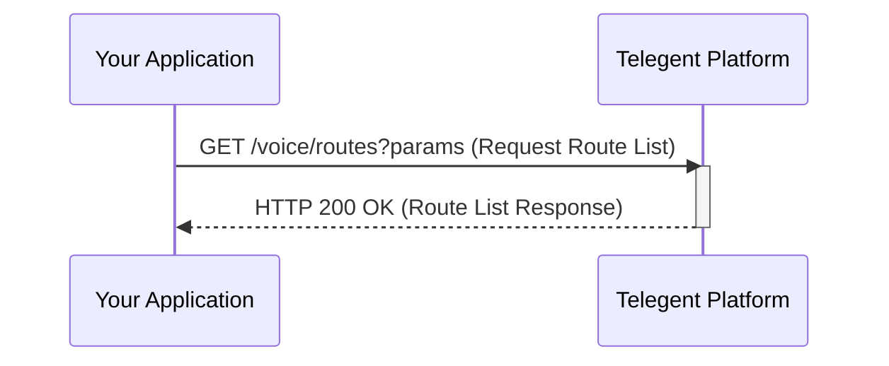

## List Voice Routes

This endpoint allows you to retrieve a list of voice routes configured for your account.

### Endpoint

`/voice/routes`

**Method:** `GET`

### Request Parameters

| Parameter   | Type    | Description                                     | Required |
|-------------|---------|-------------------------------------------------|----------|
| `PageSize`  | integer | The number of records to return per page. Defaults to 50. | No       |
| `PageToken` | string  | A token to retrieve the next page of results.     | No       |

### Response Body (200 OK)

The response will include a list of voice route objects and pagination information.

```json
{
  "VoiceRoutes": [
    {
      "RouteId": "VRID-12345",
      "RouteName": "Main Inbound Route",
      "RouteType": "Webhook",
      "InboundUrl": "https://your-app.com/voice-webhook",
      "InboundUrlMethod": "POST",
      "CreatedDate": "2023-11-01T09:00:00Z"
    },
    {
      "RouteId": "VRID-67890",
      "RouteName": "Sales Transfer",
      "RouteType": "Transfer",
      "TransferNumber": "+15558887777",
      "CreatedDate": "2023-11-01T09:30:00Z"
    }
  ],
  "NextPageToken": "string",
  "PageSize": 50
}
```

### Response Properties

| Property        | Type    | Description                                  |
|-----------------|---------|----------------------------------------------|
| `VoiceRoutes`   | array   | A list of voice route objects.               |
| `RouteId`       | string  | Unique identifier for the voice route.       |
| `RouteName`     | string  | The name of the voice route.                 |
| `RouteType`     | string  | The type of voice route (e.g., `Webhook`, `Transfer`). |
| `InboundUrl`    | string  | The URL for handling inbound calls (if RouteType is Webhook). | No       |
| `InboundUrlMethod`| string| The HTTP method for the InboundUrl.          | No       |
| `TransferNumber`| string| The phone number to transfer calls to (if RouteType is Transfer). | No       |
| `CreatedDate`   | string  | Timestamp when the route was created.        |
| `NextPageToken` | string  | Token to retrieve the next page of results, or null if no more pages. | No       |
| `PageSize`      | integer | The number of results per page.              |

### Python Example

```python
import requests

url = "https://api.telegent.com/voice/routes"

headers = {
    "Authorization": "Bearer YOUR_ACCESS_TOKEN"
}

params = {
    "PageSize": 100
}

try:
    response = requests.get(url, headers=headers, params=params)
    response.raise_for_status() # Raise an exception for bad status codes

    route_list = response.json()
    print("Voice Routes:")
    for route in route_list.get('VoiceRoutes', []):
        print(f"- Route ID: {route.get('RouteId')}, Name: {route.get('RouteName')}, Type: {route.get('RouteType')}")

except requests.exceptions.RequestException as e:
    print(f"Error retrieving voice route list: {e}")
    if response is not None:
        print(f"Response Body: {response.text}")
```

### List Voice Routes Flow

